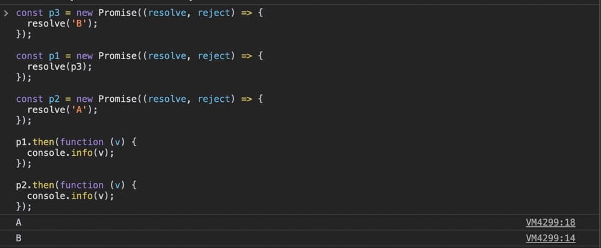
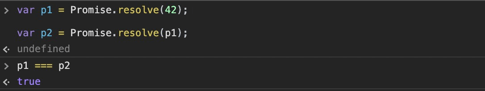
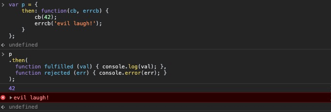
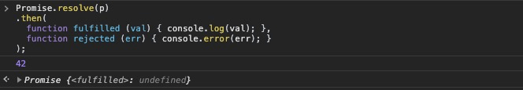
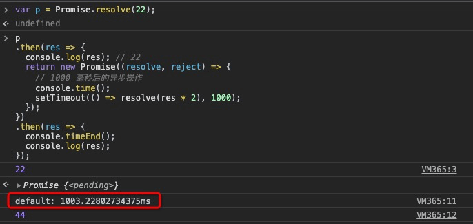
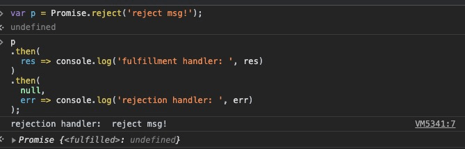

# Promises
通过前面一节的深入探讨，我们已经很清楚 回调函数 所面临的问题了 —— 书写的反人性和信任问题。显然最为头疼的是由于 *控制反转(inversion of control)* 所带来的信任问题。幸好在 ES6 中已经提供了内置的 API 来解决这个问题 —— Promise。

## Promise是什么？(What Is a Promise?)
许多开发者学习一个新技术的第一步通常是直接撸代码，搞出一个 “Hello World” 什么的。当然这没什么不好，不过想要深入理解 Promise，以及它背后所隐含的理论，不妨先从两个类比开始：

### 未来的值(Future Value)
想象一个在现实世界中常见的场景：当你走进一家快餐店(KFC啥的)的前台，准备买一个汉堡套餐来解决午饭时，你通常是先付钱，而后拿到一张小票，上面有一个数字，代表的就是“我欠你一份汉堡套餐”的 *承诺(promise)* —— 通常情况下，你最终会凭此拿到一份汉堡套餐。

在等待汉堡套餐的时间里，你会干什么呢？打开手机翻翻朋友圈？给某人发个消息说待会吃完中饭去找他聊聊天？或者浏览下最新的热点新闻？……反正不会瞎等在那里就对了 —— 而在这自信满满的等着的汉堡套餐，就是所谓的 **future value**。

时间溜走了，当 “113号，请取餐” 的声音响起，你充满期待的去前台准备接下去的大快朵颐时，此时会有两个情况等着你，第一种会按照你的期待进行，自不必说；另外一种小概率但未必不会发生的事件是：“很抱歉，我们的汉堡卖完了，您看要不来份三明治怎么样？” —— 每次当你想买汉堡套餐时，你都得做好失败的准备。

**Note**：这里的类比是个简化的场景，显然在写代码的时候，要考虑更多的事情，比如你的号码一直都没被叫(很有可能是被忘记了)，这与之对应的就是一直 “悬而未决” 的状态。

#### 现在和将来的值(Values Now and Later)
直接来段代码：

```js
var x, y = 2;

console.log(x + y); // NaN
```

👆 `x + y` 最终产生的是一个与预期结果不符的 `NaN` —— 难道你还指望 `+` 帮你监视着 `x` 和 `y` 都已经是 `number` 类型的值了，而后再帮你完成加法运算？

为了解决这种问题，你得靠自己，比如用回调函数：

```js
function add (getX, getY, cb) {
  var x, y;
  getX(function (xVal) {
     x = xVal;
     if (y != undefined) {
       cb(x + y);
     }
  }),
  getY(function (yVal) {
     y = yVal;
     if (x != undefined) {
       cb(x + y);
     }
  })
}

// `fetchX()` 和 `fetchY()` 是同步或异步的获取对应 x 和 y 值的函数
add(fetchX, fetchY, function (sum) {
  console.log(sum);
})
```

👆先别管它是否优雅，至少它能让行为可控，即在`fetchX()` 和 `fetchY()` 工作正常的情况下，无论它们是同步还是异步，`x + y` 都能正确的返回值期待的值，而非 `NaN`。

#### 承诺的值(Promise Value)
若是把上面的 `add` 用 Promise 来改写的话：

```js
function add (xPromise, yPromise) {
  return Promise.all([xPromise, yPromise])
    .then(function (values) {
      return values[0] + values[1];
    });
}

add(fetchX(), fetchY())
  .then(function (sum) {
    console.log(sum);
  });
```

👆`fetchX()` 和 `fetchY()` 都返回了 Promise 对象，而后被作为参数传入了 `add(…)` 中。

在 `add(…)` 内部，`Promise.all([…])` 接收了它们，随后它也返回一个 Promise 对象，而后在其链接的 `then(…)` 方法中，完成了 `x + y`(`values[0] + values[1]`) 的动作，并作为立即 resolve 的值返回。

最终，在调用 `add(…)` 返回的 Promise 对象后面，链接上 `then(…)` 方法，并将 `sum` 输出到了控制台上。

关键的地方是 Promise 对象本身包含了 `then` 方法，而调用 `then(…)` 方法本身又会返回一个 Promise 对象，因此这个链可以无限进行下去。

和买汉堡套餐的例子一样，我们得对意外的情况做好准备，在 Promise 中，对应的就是 `then(…)` 方法的第二个参数：

```js
add(fetchX(), fetchY())
  .then(
    function (sum) {
      console.log(sum);
    },
    function (err) {
      console.error(err);
    }
  );
```

因为 Promise 是独立于时间的，因此它可以很好的预测和组合各种情况和结果。并且更重要的是，一旦 Promise 的状态 resolve 掉了，就不能更改了 —— 尽管这个状态的结果能够被无限次的访问。

**Note**：这种 *不可更改(immutable)* 的特性，使其能够被任意的传入到各种第三方的代码中，而不必担心被无意或是恶意的篡改。而这是 Promise 设计之初，殚精竭虑完成的最基础、最重要的功能。

Promise 是一种能够很容易的封装、组合 *未来的值(fature value)* 的机制。

### 完成事件(Completion Event)
除了代表 “未来的值” 之外，对 Promise 的另一个洞见是把它视为是一个 “流程控制” 的机制 —— 将异步的任务拆解为多个步骤用来执行。

假设有一个函数 `foo` 会执行一些任务，但我们并不知道它执行的细节，以及它到底是立即执行还是延迟一会后再执行，我们只知道它会通知我们它已经完成，而后我们可以接下去做后续的任务 —— 在 JS 的编程范式中，你通常需要监听这些 “通知”，就好像事件触发的机制一样，我们能够自定义一些需求，打包成一个回调函数，并将回调函数传递给 `foo`；最终 `foo` 会根据情况触发这个回调函数，以此来完成我们的需求。

不过在 Promise 的机制下，这样的关系被反转了 —— 我们的回调函数不再是被 `foo` 触发的，而是通过 Promise 这个中间层来触发，比如下面的一段伪代码：

```js
foo(x) {
	// 异步操作……
}

foo(42)

on (foo, 'success') {
	// foo 完成了，接着做下一步事情
}

on (foo, 'error') {
	// foo 发生了点问题，处理一下
}
```

`foo(…)` 不必关心，也不用要处理一些订阅它的事件，这些都交给了 `on(…)`，这是一种很好的 "责任分离(separation of concerns)" 的实现。

但在 Promise 出来之前，在 JS 中想要实现这样的效果，只能 “魔改” 一把：

```js
function foo(x) {
	// 异步操作……

	// 返回一个 listener 对象，它有一个 `on` 方法，能够实现事件的绑定
	return listener;
}

const evt = foo(42);

evt.on('success', function(){
	// foo 完成了，接着做下一步事情
});

evt.on('error', function(err){
  // foo 发生了点问题，处理一下
});
```

👆 `foo(…)` 返回了一个对象能够处理事件的订阅，如此一来我们就能像事件机制一样来完成对 `foo` 后续任务的处理。但说到底，`listener` 依然是由 `foo` 内部实现，并没有颠覆 “控制反转” 的底层逻辑。

当然，你还能将监听 `foo` 的 `success` 和 `error` 事件分开，单独封装成 `bar` 和 `baz`：

```js
// `bar` 监听 `foo` 的 success
bar(evt);

// `baz` 监听 `foo` 的 error
baz(evt);
```

若是 `evt` 或者说 `listener` 是由一个可靠的第三方机制来生成的话，那的的确确实现了 “反控制反转(Uninversion of control)”，并且加上 “责任分离” 的效果，看上去真的很 nice。

#### Promise“事件”(Promise "Events")
其实 `evt` 就是对 Promise 的一个类比，在 Promise 的机制下，`foo(…)` 会返回一个 Promise 的实例，而后这个实例会作为参数传递给 `bar(…)` 和 `baz(…)`。

**Note**：需要注意的是之前对于事件的措辞，严格来讲，Promise 的实现并不是通过事件机制，更没有 `success` 和 `error` 之类的事件监听；不过你也能将调用其实例上的 `then(…)` 和 `catch(…)` 方法，理解成注册了 `fulfillment` 或 `rejection` 事件 —— 虽然我们不会在真实的代码中展示出来：

```js
function bar (fooPromise) {
	fooPromise.then(
		function(){
			// resolve 监听
		},
		function(){
			// reject 监听
		}
	);
}

// baz 同上

function foo(x) {
	// 异步操作……

	// 返回一个 Promise 的实例
	return new Promise(function(resolve, reject){
		// 内部调用 `resolve` 或则 `reject`，最终会触发绑定的回调
	});
}

var p = foo(42);

bar(p);

baz(p);
```

👆 `new Promise(function (resolve, reject) {})` 这种模式被称为 [revealing constructor](https://blog.domenic.me/the-revealing-constructor-pattern/) —— 被传入 Promise 构造函数的函数会被立即执行，并接受两个参数，一个是 `resolve`，调用它会产生 fulfillment 的状态；另一个是 `reject`，调用它会产生 rejection 的状态。

另一种更优雅实现的方式，将操作 `resolve` 和 `reject` 的代码分离，而不是耦合在一起：

```js
function bar() {
	// resolve 监听
}

function oopsBar() {
	// reject 监听
}

// `baz()` 和 `oopsBaz()` 同上

var p = foo(42);

p.then(bar, oopsBar);

p.then(baz, oopsBaz);
```

**Note**：`p.then(…).then(…)` 和 `p.then(…);p.then(…)` 是两个完全不一样的代码，前者的链式调用中，前后两个 `then(…)` 是不同的 Promise 实例上的方法；后者则都是出自同一个 Promise 实例的 `then(…)` 方法，并且它的状态一旦确定，就无法被改变了。


## Then的鸭式类型(Thenable Duck Typing)
使用 Promise 面临的最头疼的问题是如何确定某个对象是不是真正的 Promise。

`p instanceof Promise` 这样的检测方式没办法完全满足需求的主要原因是，浏览器窗口之间(iframe)的交互，若是它们使用的 Promise实例 是不同的构造函数创建的，那这样的检测就会失败。

再者，若是你使用了某个三方的库，它的 Promise 并非是基于原生的 Promise 来实现，那么也无法满足需求。

因此，社区内广泛流行的一种 类型检测 机制是基于 “鸭式类型(duck typing)” —— 如果它长得像鸭子，并且能像鸭子一样呱呱的叫，那么它就是鸭子。这种基于 “值的形状” 的检查，被用于 “Promise的真假美猴王” 之中，即所谓的 thenable：

```js
function isPromise (p) {
  if (p !== null && (typeof p === 'object' || typeof p === 'function') && typeof p.then === 'function') {
    // thenable!
    return true;
  }
  return false;
}
```

好像还行？立马露馅：

```js
var o = { then: function() {} };

var v = Object.create(o);

v.hasOwnProperty('then'); // false

isPromise(v); // true
```

而若是有人 无意/故意/恶意 在一些内置的类的原型对象上面添加了 `then` 方法的话：

```js
Object.prototype.then = function(){};
Array.prototype.then = function(){};

var v1 = { hello: 'world' };
var v2 = [ 'Hello', 'World' ];

isPromise(v1); // true
isPromise(v2); // true
```

👆要是你把这些对象作为参数传递给之前的 `baz`、`bar` 的话，那它们会被永远的挂起……

你可能会觉得，这是危言耸听吧？！遇到这种情况的概率实在是太小了。但你不得不防的是有一些你依赖的第三方的库，它们很可能是在 ES6 之前的产物，并且有 `then` 方法挂载在它的某个对象上。遇到这种情况，`isPromise` 就不好使了。

## Promise 和 信任问题(Promise Trust)
虽然前面我们已经通过两个很形象的类比(“未来的值”和“完成的事件”)，了解到 Promise 如何在异步领域大放光彩的，但如果仅仅到这里，不继续深入的话，那就失去了让我们了解其最重要的核心特征(也是Promise 之所以存在的根本原因)的机会 —— 信任(Trust)。

回顾下基于 回调函数 的异步代码由于其 控制反转 而带来的各种 “信任” 问题：

  - 过早的调用回调函数

  - 过迟的调用回调函数

  - 太少/太多 地调用了回调函数

  - 调用回调函数时，缺少必须的参数

  - 把各种异常和错误都 “吞掉了” 

下面，让我们一个个的来看 Promise 到底是如何解决这些问题的：

### 过早的调用(Calling Too Early)
回调函数可能是同步，也可能是异步被调用，而没有一个内置的机制确保其一定是异步的，除非手动的使用 `setTimeout(…)`。

而在 Promise 的机制中，任何放到 `then(…)` 中的回调函数，能够被确保总会是异步被调用的(准确来讲是通过 *任务队列* 的机制来实现的)。

### 过迟的调用(Calling Too Late)
👆 和上面的一样，任何放到 `then(…)` 中的回调函数，在 调用了由 Promise 提供的 `resolve(…)` 或 `reject(…)` 后，能够确保总会在接下去的任务队列中被调用 —— 你不可能在同步的任务中观察到它被执行。因此，当一个 Promise 实例的状态发生改变，那么所有注册在它的 `then(…)` 方法上的回调函数都会按照注册的顺序被调用，即便是在这些回调函数的内部，也没办法影响(延迟)其他的回调函数：

```js
const p = new Promise((resolve, reject) => {
  resolve('some data');
});

p.then(function () {
  p.then(function () {
    console.info('C');
  });
  console.info('A');
});

p.then(function () {
  console.info('B');
});

// A B C
```

👆 `'C'` 无法阻止或改变 `'B'` 的执行(顺序)，而这也是 Promise 的优势之一。

#### Promise 顺序的怪癖(Promise Scheduling Quirks)
需要格外注意的是，在两个分开的 Promise 链式代码里的回调函数，你是没有办法确保它们的执行顺序的。比如，两个 Promise 的实例 `p1` 和 `p2` 同时变到了 resolved 的状态，`p1.then(…)` 和 `p2.then(…)` 书写的先后顺序通常是其内部回调函数的执行顺序，但若是改变一些细节：

```js
const p3 = new Promise((resolve, reject) => {
  resolve('B');
});

const p1 = new Promise((resolve, reject) => {
  resolve(p3);
});

const p2 = new Promise((resolve, reject) => {
  resolve('A');
});

p1.then(function (v) {
  console.info(v);
});

p2.then(function (v) {
  console.info(v);
});

// A B
```





👆并非按照设想的打印出了 `B A`，这是因为 `p1` 中的 `resolve(p3);` 其实是 resolve 了另一个异步任务，而 `p2` 则 resolve 的一个同步任务，因此在这个维度看，`p2` resolve 的结果要早于 `p1` 的结果。不过这一切都发生在同一个任务队列中，即 **它们resolve的结果** 并没有同步和异步的区别。

### 没有调用回调函数(Never Calling the Callback)
这个问题在 Promise 中很好搞定：只要你注册了 fulfillment 和 rejection 的回调函数，一旦 Promise 的状态改变，就必然会调用其中的某一个回调。至于所谓的会被 “永远地挂起”，即状态永远没有任何改变？其实很好解决：

```js
function timeoutPromise (delay) {
  return new Promise(function (resolve, reject) {
    setTimeout(function () {
      reject('timeout');
    }, delay);
  })
}

Promise.race([
  foo(),
  timeoutPromise(3000)
])
.then(
  function () {},
  function (err) {}
);
```

一旦 `3000` 毫秒过了，`foo()` 返回的 Promise 实例还没确定状态的话，就会走到超时的逻辑中，因此你也不用担心你的程序会被 “永远地挂起”。

### 太少/太多 的调用(Calling Too Few or Too Many Times)
理想的回调函数被调用的次数肯定是 one —— 这没有疑议吧？！那么 “太少” 就是没有被调用，那就回到👆上面提到的部分。

“太多” 的疑虑也很容易被解决 —— 一旦 Promise 状态确定了，那之后就无法再次改变，即便你反复的调用实例化时，提供给你的 `resolve(…)` 和 `reject(…)`，Promise 实例只会接受第一个被调用的，其他的都会被忽视。

因此，任何注册在 `then(…)` 中的回调，只会被调用一次。当然，你能够无限制的在相同的 Promise 实例中注册相同的回调函数，比如 `p.then(f); p.then(f);`，那它们会被与之对应的次数… —— 不过那是你自己的非得要搬起石头砸自己的脚，你怪谁？！

### 缺少所需的参数(Failing to Pass Along Any Parameters/Environment)

`resolve(…)` 和 `reject(…)` 都能接收 **一个** 任何类型的参数，它们会被传递给所有注册的回调函数。

若是超过了一个参数？除了第一个，其他都会被 “无情的抛弃”。千万别幻想用 `resolve(…);resolve(…);resolve(…);……` 来实现多个参数的传递 —— 还是老老实实的用 `object` 或者 `array` 来包裹多个参数比较现实。

另外，任何注册到 `then(…)` 中的回调函数，都保存了定义它时的上下文，即 “闭包” 这个能力依然有效。

### “吞掉了”各种异常和错误(Swallowing Any Errors/Exceptions)

```js
const p = new Promise(function (resolve, reject) {
	foo.bar();
	resolve(42);
});

p.then(
	function fulfilled () {
    // 永远到不了这儿
  },
	function rejected (err) {
    // TypeError
  }
);
```

👆 `foo.bar();` 是产生错误的源头，而且即便是这个异常是发生在 Promise 的实例化过程中(同步)，也会让这个异常在异步的行为中被捕获 —— 这一点非常牛逼，能够让你无感的就解决了之前提到的 race condition 的问题，无论这段代码否产生了异常。

那若是异常发生在 `fulfilled` 的回调函数中呢？

```js
const p = new Promise(function (resolve, reject) {
	resolve(42);
});

p.then(
	function fulfilled (val) {
    foo.bar();
    console.info(val);
  },
	function rejected (err) {
    // 永远到不了这儿
  }
);
```

好像把异常“吞掉了”？那只是幻觉 —— `p.then(…)` 其实会返回另一个 Promise 的实例，而这个实例则会进入到异常捕获的状态。

你可能会想，为啥不直接进入到当前这个 Promise 实例的异常捕获完事？当然不能，因为这违背了 Promise 最重要的原则 —— 一旦状态确定就不能改变。即 `p` 总是 值为 `42` 的 fulfilled 的状态。而若是违背了这一原则，试想下，当你在同一个 Promise 的实例上，注册了多个回调的时候，就会发现有的结果是这样，有的结果是那样……

### 能被信任的Promise?(Trustable promise?)
在我们完全信任 Promise 之前，还有最后一个问题需要仔细的探讨下 —— Promise 并没有摆脱掉回调函数，而仅仅是改变了回调函数传递的位置 —— 不再是把回调函数传到 `foo` 里面去，而是将回调函数传入 `foo(…)` 的返回值中。但为什么这种模式就值得信任呢？难道仅仅是因为它已被信任了，所以就信任了么？！

对于内置的静态方法 `Promise.resolve(…)`，若是你传入的是一个非异步、非Promise、非thenable的值，那你会得到一个 `fulfilled` 的值，比如👇下面两个 Promise 其实是没啥区别的：

```js
var p1 = new Promise((resolve, reject) => {
  resolve(42);
});

var p2 = Promise.resolve(42);
```

但若是你传入的是一个 Promise 的值，那则会原封不动的将其返回：

```js
var p1 = Promise.resolve(42);

var p2 = Promise.resolve(p1);

p1 === p2; // true
```



更为重要的是，对于随意使用 非Promise的thenable 导致的意外的后果：

```js
var p = {
	then: function(cb, errcb) {
		cb(42);
		errcb('evil laugh!');
	}
};

p
.then(
  function fulfilled (val) { console.log(val); },
  function rejected (err) { console.error(err); }
);
```



👆 `p` 是一个 `thenable` 但并非是严格按照 promise 的规范来设计的，它不能被信任。不过呢，我们可以把它作为值，传入到 `promise.resolve(…)` 中，来解决信任问题：

```js
Promise.resolve(p)
.then(
  function fulfilled (val) { console.log(val); },
  function rejected (err) { console.error(err); }
);
```



因此，若是当我们要使用某个第三方的 thenable 的工具函数 `foo(…)` 时，`Promise.resolve(…)` 能确保其返回的值一定是可信任的 Promise：

```js
Promise.resolve(foo(42))
.then(function (v) {
	console.log(v);
});
```

除此之外，`Promise.resolve(…)` 还有个好处它能 “格式化” 传入的值 —— 无论传入的值是立即执行的同步代码，还是延迟执行的异步代码，最终它返回的值都是异步的。

### 信任的建立(Trust Built)
回到多年前，当 JS 的所有异步任务只能用回调函数解决的时候，信任问题有显得那么重要么？不一定吧！？但是时至今日，当你一旦接触而后使用过了 Promise，再回头看看以前的，仅仅由回调函数构成的摇摇欲坠的异步代码时，你发现你再也回不去了……

Promise 通过颠覆控制反转，带来的不仅仅是可信任的代码和执行机制，更为重要的是它解放了我们的心智，让我们能够更专注于其他任务。

## 链式流(Chain Flow)
前面我们已经看过不止一遍了，我们可以用一连串 *this-then-that* 的操作，将许多个 Promise 串联起来，组成一个有序的异步链式代码块。

而让这一切起作用的核心，源自于 Promise 的两个内置的行为模式：

- 每次调用 Promise 的 `then(…)` 方法后，都会返回一个新的 Promise，因此我们可以一直链接下去；

- 无论 `then(…)` 的 fulfillment 回调函数(即 `then` 的第一个参数) return 任何值，它都会被自动的设置为 Promise 链中的 fulfillment 状态。

```js
var p = Promise.resolve(22);

var p2 = p.then(res => {
  console.log(res); // 22
  return res * 2;
});

p2.then(res => console.log(res)); // 44
```

return 的 `res * 2` 就是第一个 `then(…)` 方法的 fulfillment 回调函数返回的值，它会被自动设置为 `p2` 的 `then(…)` 方法的 fulfillment 回调函数接收到的值。而后你可以将 `p2.then(…)` 返回的值储存到另一个变量 `p3` 中，并操作它的 `then(…)` 方法……

可即便是将 Promise 储存于 `p2` 也显得有些多余，直接 “串” 起来其实就可以了：

```js
var p = Promise.resolve(22);

p
.then(res => {
  console.log(res); // 22
  return res * 2;
})
.then(res => console.log(res));
```

👆无论你想 “串” 起多少个 `then(…)` 都是可以的，这源于每个 `then(…)` 都会自动的返回一个新的 Promise 的本质所在。

到这里，“这道菜” 似乎一切都很完美，但还是感觉缺点调料 —— 若是想在 `then(…)` 中处理一个异步事件，发起一个网络请求的话，要怎么做呢？关键依然在 `then(…)` 的返回值上：

```js
var p = Promise.resolve(22);

p
.then(res => {
  console.log(res); // 22
  return new Promise((resolve, reject) => {
    resolve(res * 2); // 将 Promise 的状态设置为 fulfill，以便能在下一个 then(…) 中的第一个回调函数中拿到相应的值
  });
})
.then(res => console.log(res));
```

👆看见了么？关键是 return 一个 thenable 或 Promise，而后在下一个 `then(…)` 方法里的回调函数被调用前，会一层层地递归拆解(unwrapping)这个返回的 thenable 或 Promise，直到它的最后状态被确定下来(resolution)为止。

因此，想要在这一串链式中实现异步操作：

```js
var p = Promise.resolve(22);

p
.then(res => {
  console.log(res); // 22
  return new Promise((resolve, reject) => {
    // 1000 毫秒后的异步操作
    console.time();
    setTimeout(() => resolve(res * 2), 1000);
  });
})
.then(res => {
  console.timeEnd();
  console.log(res);
}); // log会发生在 1000 毫秒后
```



👆这也意味着，每一步都能使用异步，精准地控制何时触发下一步的回调函数，形成一条完整的异步流：

```js
function delay (time, data) {
  return new Promise(function (resolve, reject) {
    setTimeout(() => resolve(data), time)
  });
};

delay(100)
.then(function step2() {
  console.log('step 2 after 100ms');
  return delay(200);
})
.then(function step3() {
  console.log('step 3 after 200ms');
})
.then(function step4() {
  console.log('step 4 next job');
  return delay(50);
})
.then(function step5() {
  console.log('step 5 after 50ms');
})
```

若是没有指定 return 值，那么就会返回 `undefined`，但这并不会影响到 Promise 的链式流。但说句实话，简单的使用 `setTimeout` 来延迟代码执行的时间，在实际的开发中并没有什么用，👇以下是更贴近实际开发的例子：

```js
function request (url) {
  return new Promise((resolve, reject) => {
    ajax(url, resolve);
  });
}

request('http://some.url.1/')
.then(response1 => request(`http://some.url.2/?v=${response1}`))
.then(response2 => console.log(response2));
```

两个串行的网络请求，第二个请求依赖于第一个请求返回的值，这样的场景在实际的开发过程中很常见。此时 Promise 的链式结构不仅实现了多个异步任务按照顺序串行进行，而且还能够在每个步骤间实现消息的传递。

不过，任何程序都可能会发生异常情况，在 Promise 中当然也内置了对异常的处理逻辑：

```js
request('http://some.url.1/')
.then(response1 => {
  foo.bar(); // error!
  request(`http://some.url.2/?v=${response1}`);
})
.then(
  response2 => console.log(response2),
  err => {
    console.log(err);
    return 42;
  }
)
.then(msg => console.log(msg)); // 42
```

`then(…)` 的第二个参数就是当异常发生时，被调用的 rejection 回调函数。无论是 `reject`、`throw new Error(…)`、或者是上面看到错误代码 `foo.bar();`，都会激活 rejection 回调函数。

无论是忽略 fulfillment 还是 rejection 的回调函数，一旦 Promise 的状态被确定后，都会继续沿着 Promise 链冒泡，直到遇见处理它的回调函数为止：

```js
var p = Promise.reject('reject msg!');

p
.then(
  res => console.log('fulfillment handler: ', res)
)
.then(
  null,
  err => console.log('rejection handler: ', err)
);
```



**Note**：本质上来看，`then(null, function (err) { //... })` 的模式和 `catch(function (err) { //... })` 行为一致。

无论链式流多么有用，都不该把它视为是 Promise 的最核心的意义所在，顶多算作是一个副产品。而 *标准化异步操作流程* 和 *将时间和状态都封装到值的依赖中*，是让我们能够将其链接起来的关键所在。

不过，链式调用的 *this-then-this-then-this...* 的模式依然有太多的 “八股(boilerplate)” 需要一次又一次的被实现出来，而解决这个问题是需要一个更为优雅的异步流程控制模式 —— generator。

### 术语：Resolve, Fulfill 和 Reject(Terminology: Resolve, Fulfill, and Reject)
对于 "resolve"、"fulfill"、"reject" 这些术语，好像大致能区别它们，但始终有一些困惑，不明白它们之间到底有啥不一样。先别急，来看一段代码：

```js
var p = new Promise(function (x, y) {
  // x() -> fulfillment
  // y() -> rejection
});
```

通常情况下，实例化 Promise 的回调函数中，第一个参数的调用 `x()` 标志着 Promise 被定为 fulfill 的状态，第二个参数则代表 Promise 被定为 reject 的状态。但请注意这个细节 —— “通常”。

本质上来看，你写的代码 `function (x, y) { //… }` 对于 JS引擎 来说都是一样的 —— 无论是 `x` 还是 `y` 对它来讲都只不过是相同的函数体，但是函数的名字，不仅仅关乎你自己对于代码的理解，更为关键的是你团队的其他开发者如何理解你的代码。一段即便是精心编排设计，但思考错误的异步代码带来的危害，远比意大利面条般的回调地狱(spaghetti-callback)异步代码危害更大，因此如何给 `x` 和 `y` 一个准确的命名显得尤为重要。

👆使用 `reject(…)` 来命名实例化 Promise 回调的第二个参数是一个正确的选择。而对于第一个参数的称谓，即便是官方推荐使用的 `resolve(…)`，却也总是会让人联想到 "resolution(决定)" 的意思 —— 这个含义通常会被理解为 “确定 Promise 最终的值/状态”。

若是第一个参数被指定为 Promise 的 fulfill 状态的话，那为何我们不用 `fulfill(…)` 取代 `resolve(…)` 呢？要回答这个问题，还得仔细看看两个 Promise 的 API：

```js
var fulfilledPr = Promise.resolve(42);
var rejectedPr = Promise.reject('err');
```

`Promise.resolve(…);` 这个 API 将数字 `42` 定为 Promise 的最终值，状态为 fulfilled；而 `Promise.reject('err');` 显然是创建一个状态为 rejected 的 Promise，理由(值)是 `err`。

👆这好像并没有说明为啥 `resolve(…)` 不用 `fulfill(…)` 的问题？先别急，看下面一段代码：

```js
var rejectedTh = {
  then: function (resolved, rejected) {
    rejected('err msg');
  }
};

var rejectedPr = Promise.resolve(rejectedTh);
```

还记得吗？`Promise.resolve(…)` 会将传入其中的 thenable 或者 Promise 解析并展开，就上面的例子而言，`Promise.resolve(…)` 会返回一个状态是 rejected 的 Promise。因此，这个时候若是用 `fulfill(…)` 作为方法名就显得很不合时宜了，相比较而言，`resolve(…)` 显然是更好的选择。

而即便是在实例化 Promise 的回调函数中，第一个参数同样和 `Promise.resolve(…)` 一样，会解析传入其中的 thenable 或者 Promise：

```js
var rejectedPr = new Promise(function (resolve, reject) {
  resolve(Promise.reject('err msg'));
});

rejectedPr.then(
  function fulfilled () {
    // never gets here
  },
  function rejected (err) {
    console.log(err); // "err msg"
  }
);
```

所以，`resolve(…)` 显然也是实例化 Promise 的回调函数中的第一个参数更为准确的名称。

**Note**：👆 `resolve(Promise.reject('err msg'));` 并不会把 `Promise.reject('err msg')` 的 `'err msg'` 解析出来，做这件事情的是 `then(…)` 中的 `rejected` 回调函数。

而对于在 `then(…)` 方法中定义的两个回调函数呢？`fulfilled(…)` 和 `rejected(…)` 显然更为准确：

```js
function fulfilled (res) {
  console.log(res);
}

function rejected (err) {
  console.error(err);
}

p.then(
  fulfilled,
  rejected
);
```

在 ES6 的说明文档里面用的是 `onFulfilled(…)` 和 `onRejected(…)`，而实际上也的确如此，第一个回调的触发是 Promise 被确定为 fulfill 状态；而第二个回调的触发是 Promise 被确定为 reject 状态。


## 错误处理(Error Handling)
同步的 `try…catch` 是大多数JS开发者选择的异常处理方式。但是在异步代码中发生的异常，这个方案显得力不从心：

```js
function foo () {
  setTimeout(function () {
    baz.bar();
  }, 1000);
}

try {
  foo();
}
catch (err) {
  console.error('try catch 捕获的异常：', err);
}
```

除非通过一些特殊的手段，否则 `try…catch` 没办法搞定异步代码的异常处理。

若是传统的回调异步，异常的处理一般是通过所谓的 “错误优先(error-first callback style)” 模式：

```js
function foo (cb) {
  setTimeout(function () {
    try {
      var x = baz.bar();
      cb(null, x);
    }
    catch (err) {
      cb(err);
    }
  }, 1000);
}

foo(function (err, val) {
  if (err) {
    console.error('error-first callback: ', err);
  } else {
    console.log(val);
  }
});
```

传入 `foo(…)` 的回调函数的第一个参数，若是非 falsy 的值，就会被认为异常发生了；否则的话，就是成功了。虽然这种异步的错误处理在技术上是可行的，但是和回调地狱的问题一样，若是有多个 `if…else…` 的面条代码，绕也能把你绕晕。

Promise 采用的异常处理策略是 “分而治之”，即将异常处理的回调函数拆分开：

```js
var p = Promise.reject('err msg');

p.then(
  function fulfilled () {
    // …
  },
  function rejected (err) {
    console.error(err);
  }
);
```

这种模式看上去好像挺好的，但其实呢，也是有隐含的问题存在的：

```js
var p = Promise.resolve(42);

p.then(
  function fulfilled (res) {
    // number 没有 toLowerCase 方法
    // 因此会抛出异常
    console.log(res.toLowerCase());
  },
  function rejected (err) {
    // …
  }
);
```

👆之前我们[讨论过](https://github.com/BobbyLH/ReadingNotes---You-Dont-Know-JS/blob/master/async%20%26%20performance/Promises.md#%E5%90%9E%E6%8E%89%E4%BA%86%E5%90%84%E7%A7%8D%E5%BC%82%E5%B8%B8%E5%92%8C%E9%94%99%E8%AF%AFswallowing-any-errorsexceptions)为什么 `function rejected (err) { // … }` 没办法捕获到异常，这里就不再赘述。

这很好的解释了为什么在 Promise 中处理异常很容易出问题。

**警告**：若是你在创建 Promise 的过程中，没有按照规范来(比如 `new Promise(null)`、`Promise.all()`、`Promise.race(42)`)，那这个异常会立刻被抛出，而不是被解析为 rejected 状态后，由 reject 的回调函数来处理。

### 绝望之坑(Pit of Despair)