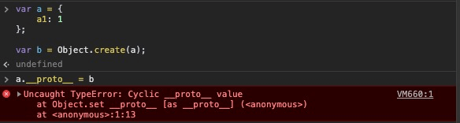
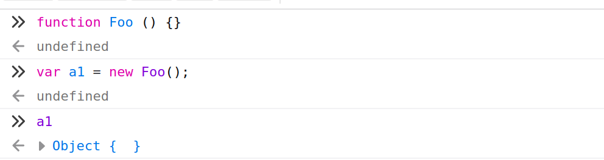
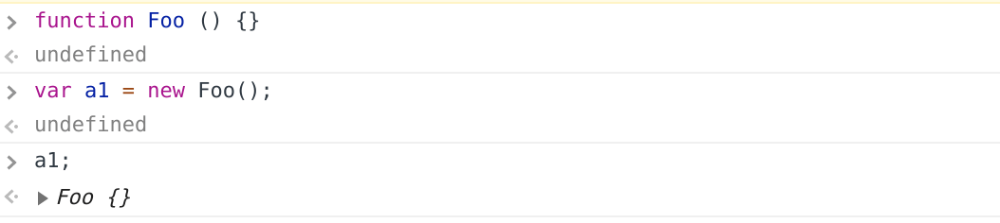
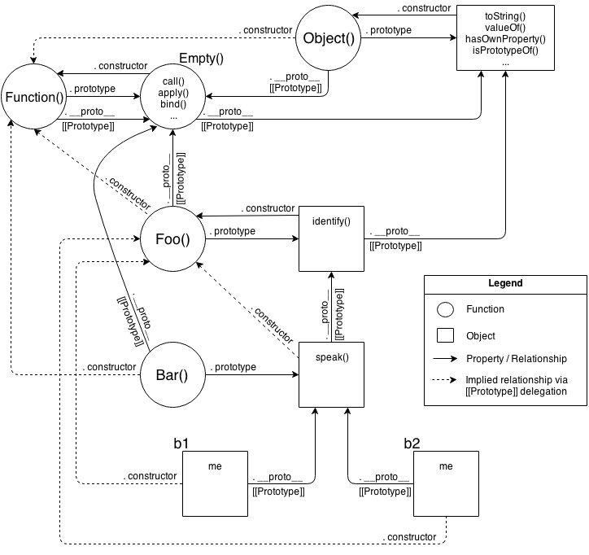
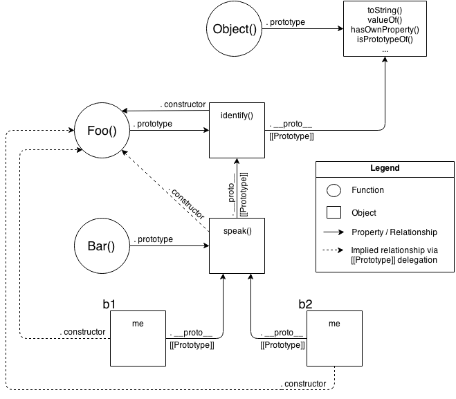
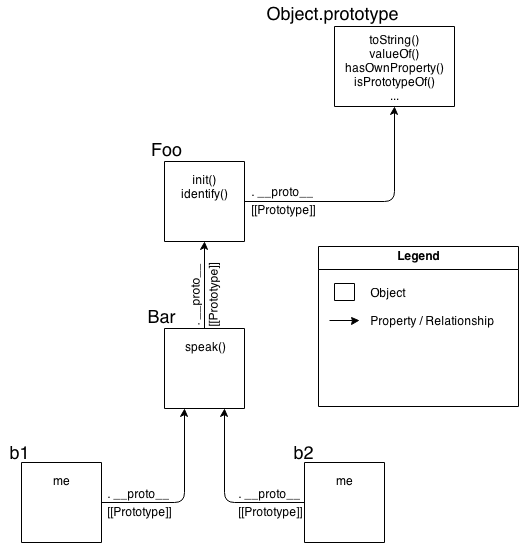

# 行为代理(Behavior Delegation)
虽说在前面的一章已经介绍了不少有关于JS中的 `[[Prototype]]` 的机制，也探讨了为什么使用它去模拟 “类” 和 “继承” 是利大于弊的情况 —— 不仅是 `.prototype` 胡乱堆放，更有使用 `.constructor` 试图去解决令人恶心的伪多态语法，以及各种 “混合(mixin)” 的尝试……

你可能想说：到此为止了！但如果你不继续深入，而是将这些现象当做理所当然的 “黑盒(black box)”，那你可能会错过习得在JS中使用一种更为直观、间接的设计模式，它会让你的代码更清晰明了、易于维护。

再次回顾一下 “原型链(prototype chain)” 的机制：在JS的对象中，存在一个内部的连接，指向另外某个对象；当引用某个对象中并不存在的方法或属性时，通过这个内部的连接(即原型对象 prototype)，查找另外一个关联对象上是否存在这个属性或方法；如果没有找到，则会继续查找该对象上的原型对象，直到查询到结果或者抵达 `Object.prototype` 为止…

👆由此可见，关键的机制是 **对象能关联到其他对象** —— 这是帮助我们理解后面内容的基础和关键。

## 面向代理设计(Towards Delegation-Oriented Design)
磨刀不误砍柴工，为了能更好的聚焦于 `[[Prototype]]` 的使用，先让我们看看它和类的设计模式到底有什么不同。

**Note**：有一些面向类的设计理念依然很有用，比如 *封装(encapsulation)* 就能兼容于面向代理的设计模式 —— 别把所有的东西都扔掉。

### 类的原理(Class Theory)
假设我们有几个相似、重复的任务需要处理，这时候需要对这些任务的模型进行抽象。

如果使用类的设计模式，通常应该包含如下步骤：定义一个父(基)类 `Task`，它包含了能被其他子类共享的各种行为；接着定义子类 `XYZ` 和 `ABC`，它们都继承于父类 `Task`，并且都添加了自己的特定的行为去处理各自的任务。

关键在于，类设计模式会鼓励你尽可能多的去利用继承带来的便利。而当需要处理特定的行为时，使用多态(polymorphism)或者改写(override)的特性，如使用诸如 `super` 关键字，来实现。可以说 **抽象通用的行为** 和 **改写特定行为** 在面向类的设计模式中无处不在。

比如下面的伪代码：
```js
class Task {
	id;

	// constructor `Task()`
	Task(ID) { id = ID; }
	outputTask() { output( id ); }
}

class XYZ inherits Task {
	label;

	// constructor `XYZ()`
	XYZ(ID,Label) { super( ID ); label = Label; }
	outputTask() { super(); output( label ); }
}

class ABC inherits Task {
	// ...
}
```

用 `ABC` 或 `XYZ` 实例化后得到的实例，会从各自的类以及类继承的父类中复制拷贝行为；最终它们只能和自身进行交互而互不干涉，每个实例都有执行任务所需要的行为的全部副本。

### 代理的原理(Delegation Theory)
同样的问题，我们尝试换用 *行为代理(behavior delegation)* 来解决。

首先需要定义一个 **对象(object)**(注意不是 `class`，也不是 `function`) 叫 `Task`，在它上面定义一些用于各种任务的通用方法；而后，将每一个任务都同样定义为一个 **对象**，将它们和 `Task` 关联起来，允许它们代理 `Task` 里面的各种方法：

```js
var Task = {
	setID: function (id) { this.id = id; },
	outputID: function () { console.log(this.id); }
};

var XYZ = Object.create(Task);

XYZ.prepareTask = function (id, label) {
	this.setID(id);
	this.label = label;
}

XYZ.outputTaskDetail = function () {
	this.outputID();
	console.log(this.label);
}
```

👆无论是 `Task` 还是 `XYZ` 都只是一个对象，而 `XYZ` 通过 `Object.create(Task);` 关联到了 `Task`，从而能利用原型链机制，代理它的诸如 `setID`、`outputID` 等方法。和面向类(面向对象 object-oriented —— OO)不同，这个设计模式被作者称为 **"OLOO"**(objects-linked-to-other-objects)，我翻译为 *面向关联*。

用 **OLOO** 书写代码的风格，需要注意：

1. 无论 `id` 还是 `label`，借助 `this` 的隐式绑定规则，这些状态变量都直接保存在 `XYZ` 而非 `Task` 中；

2. 使用类的设计模式，我们常常采取的是利用多态，改写某个同名方法。但在行为代理设计模式中，我们反其道而行之 —— 尽可能避免重复命名，而利用 `this` 和 `[[Prototype]]` 的机制。这样的好处是避免了因为名字而导致的诸多尴尬：比如方法命名的时候不用考虑通用性，而是解释其本身行为，自带文档说明。同时也能消除很多歧义，让代码更好维护。

3. `XYZ.prepareTask` 里的 `this.setID(id);` 会通过原型链查找机制，代理到 `Task` 上定义的 `setID(…)` 方法，但这并不会改变 `setID(…)` 方法中的 `this` 的指向 —— 它依然指向的是 `XYZ`。换句话说，在定义通用方法的 `Task` 中，依然能够和 `XYZ` 交互，因为 `XYZ` 代理了 `Task`。

行为代理即是：**当某个对象(`XYZ`)中不存在某个属性或方法时，提供代理到另一个对象(`Task`)的同名属性和方法的能力**。

**Note**：OLOO 这种设计模式不会径直的将代理过来的API暴露出来(比如上例中 `XYZ.setID(…)`)，而是将其作为执行的细节，融合在另一个更具语义化的方法中。

#### 相互代理(Mutual Delegation)
注意，这是一个不被编译器认可的行为(会抛出错误) —— 两个对象之间相互代理彼此。

两个对象之间相互代理，这不仅可能会造成死循环(当引用的变量或方法在两个对象中都不存在时)，还会导致一些性能问题。当然，如果很确定引用必然存在，那么任意一个对象都能引用某个确定存在的属性或方法，这兴许能解决一些小众问题。

很可惜，这并不被允许，而且是在代码编译阶段就会出错：

```js
var a = { a1: 1 };
var b = Object.create(a);

a.__proto__ = b; // TypeError
```



#### Debugged
大体上讲，JS 规范并没有强制要求各个浏览器厂商的 _开发者工具(developer tools)_ 应该按照某个规范来实现，因此每个浏览器都会有大体上差不多，但充满了各种微妙区别的实现机制。就比如 "class constructor" 风格的代码，在 Chrome 和 Firefox 的 Developer Tools 中各有不同：

```js
function Foo () {}

var a1 = new Foo();

a1;
// Foo {}  --- chrome
// Object { } --- firefox
```

ubuntu19.10 - firefox - 74.0 (64-bit)：



ubuntu19.10 - chrome - 80.0.3987.116 (Official Build) (64-bit)：



👆 Chrome 本质上是在说： `a1` 是由名为 `Foo` 的函数创建的一个空对象；而 Firefox 则认为 `a1` 是一个由 `Object` 构造函数创建的空对象。这其中的区别在于前者会主动的跟踪创建该对象的真实构造函数的具体信息，而后者采用取巧的方案：即所有的对象追根溯源，本质上都是由 `Object` 构造函数创建，因此不用费力去跟踪额外的信息。

在 Chrome 的开发者工具的控制台中，接着输入下面的代码：

```js
a1.constructor; // Foo () {}

a1.constructor.name; // "Foo"
```

👆 好像 `a1.constructor.name;` 结果和 `a1;` 的输出一致，都正确的指向了构造函数 `Foo`，但这是真的吗？：

```js
Foo.prototype.constructor = function Gotcha();

a1.constructor; // Gotcha () {}

a1.constructor.name; // "Gotcha"

a1; // Foo {}
```

此时即使 `a1.constructor.name;` 已经正确的返回了 `"Gotcha"`，但 `a1;` 依旧输出了 `Foo {}` —— 这个bug的存在不是一天两天了，也不知道之后是否会修复，不过别着急，再看看 OLOO 设计模式是否受到影响：

```js
var Foo = {};

var a1 = Object.create(Foo);

a1; // {}

Object.defineProperty(Foo, 'constructor', {
	enumerable: false,
	value: function Gotcha() {}
});

a1; // Gotcha {}
```

你可能会说，Chrome 这不是吃力不讨好么，本来这并不是 JS 规范的要求，结果还弄出了bug。但抛开bug来说，如果你彻底放弃使用类的设计模式，投向OLOO的怀抱，那你也不会纠结 *到底谁才是这个对象的构造函数* 这样一个毫无意义的问题了！

### 思维模式的较量(Mental Models Compared)
对于 “类” 和 “代理” 两种不同的设计模式，至少从理论上能区别出其中的差异了。接下去不妨从思维模式的角度来看看这两者的不同之处：

```js
function Foo (who) {
	this.me = who;
}

Foo.prototype.identify = function () {
	return 'I am ' + this.me;
}

function Bar (who) {
	Foo.call(this, who);
}

Bar.prototype = Object.create(Foo.prototype);

Bar.prototype.speak = function () {
	console.log('hello, ' + this.identify() + '.');
}

var b1 = new Bar('b1');
var b2 = new Bar('b2');

b1.speak(); // "hello, I am b1."
b2.speak(); // "hello, I am b2."
```

👆经典的面向对象(OO)风格的代码，父类是 `Foo`，子类是 `Bar`，两个实例化的对象分别是 `b1` 和 `b2`，它们能通过原型链的机制访问 `Bar.prototype` 和 `Foo.prototype` —— 没什么特别之处。

如果换成是 OLOO 风格的代码，则只有利用原型查找机制，形成对象之间的关联，而没有涉及到乱七八糟的诸如 构造函数、原型，以及 `new` 的调用等概念：

```js
var Foo = {
	init: function (who) {
		this.me = who;
	},
	identify: function () {
		return 'I am ' + this.me;
	}
};

var Bar = Object.create(Foo);

Bar.speak = function () {
	console.log('hello, ' + this.identify() + '.');
}

var b1 = Object.create(Bar);
b1.init('b1');

var b2 = Object.create(Bar);
b2.init('b2');

b1.speak(); // "hello, I am b1."
b2.speak(); // "hello, I am b2."
```

你也许会问，既然两者都能实现对应的功能，并且OLOO的模式看上去更简洁，那是否意味着 OLOO 就是更好的选择呢？

别着急回答，先贴两张原书的图来看看实现它们的底层思维模式是怎么做的：

首先是面向对象的思维模式：



这些个关系复杂不？实际上把这些关系弄懂对个人也是有很多好处的，比如对于为什么每个函数都能调用 `call(…)`、`apply(…)`、`bind(…)` 这些方法其实是因为所有的函数本质上都是一个对象，因此这些 函数-对象 都能通过原型链访问到 `Function.prototype` 原型对象，在其上就定义了这些个默认的方法。

下面还有一个简化版，其实不看也罢：



重点来了，看看 OLOO 的思维模型：



👆这才是简单到没朋友的关系，清晰明了，只有对象和代理关系。所以，如果你不想陷入各种说不清道不明的 “复杂关系” 的话，OLOO设计模式是不二之选。

## 类 vs. 对象(Classes vs. Objects)