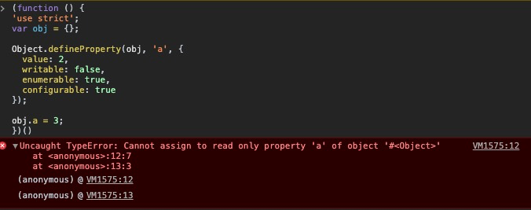

# 对象(Objects)
前面两节的内容主要解释了 `this` 是如何根据规则，指向某个对象的 *上下文* 的。但对象到底是什么？为什么需要指向它呢？

## 语法(Syntax)
JS中创建 **对象(Objects)** 源于两种形式：*字面量声明(literal declarative)创建* 和 *构造(constructed)创建*。

字面量创建：
```js
var obj = {
  key: 'value'
};
```

构造函数创建：
```js
var obj = new Object();
obj.key = 'value';
```

两种模式创建出的对象都一样，唯一的区别在于 字面量创建 可以一次性的添加多个 *键值对(key/value pairs)*，而 构造函数创建 模式只能创建好对象后，再一个个的往里面添加。

## 类型(Type)
对象在JS这门语言中的重要性不言而喻，它是JS主要的语言类型中的一种：
- `string`

- `number`

- `boolean`

- `null`

- `undefined`

- `object`

`string`、`number`、`boolean`、`null` 和 `undefined` 都属于 简单的原始类型，特别要强调的是 `null`，在使用 `typeof null` 判断其类型时，得到的结果是 `"object"` —— 这是一个历史遗留的bug，实际上，`null` 是原始类型的值。

这句话：**“在JS中万事万物皆对象”** —— **显然是不对的**。

相反，有几种特殊的对象子类型，我们通常将它们视为是复杂类型。`function` 就是其中之一，它不仅是JS中的 *一等公民(first class)*，你可以像操作普通对象一样操作它；并且，它还被赋予了 callable behavior。

数组也是对象子类型之一。它能够让数据更轻量化的组合在一起。

## 内置对象(Built-in Objects)
下面几种 内置的对象子类型(也称为包装对象) 有一些和 原始类型 有密切的关联：
- `String`

- `Number`

- `Boolean`

- `Object`

- `Function`

- `Array`

- `Date`

- `RegExp`

- `Error`

在某些语言中，上述的这些类型会被定义为某种 类(class)，比如Java的 `String` 类。但在JS中，它们的本质只是 内置的函数(built-in function)，加上关键字 `new` 来调用它们构造出一个对象的子类型，例如：

```js
var str_primitive = 'string';
typeof str_primitive; // "string"
str_primitive instanceof String; // false

var str_object = new String('string');
typeof str_object; // "object"
str_object instanceof String; // true

Object.prototype.toString.call(str_object); // "[object String]"
```

👆由 `new String('string');` 构造出的 `str_object` 显然是 `object` 的子类型。而由字面量直接创建的 `str_primitive` 是货真价实的 `string` 原始类型。

想对 `str_primitive` 进行一些字符串的操作，比如获取其长度、截取某个字符等，需要将其转换成对象类型的 `String`。所幸的是，这些冗余的工作被JS自动完成了，而且相当的智能 —— 这也意味着用 `String` 构造函数创建一个字符串显得不仅多余，而且还不方便阅读和维护。**只有当你需要用到额外的选项时，才考虑使用构造函数的形式去创建。**

```js
var str_primitive = 'string';

str_primitive.length; // 6

str_primitive.charAt(3); // "i"
```

同样的规律也适用于 `Number`、`Boolean` 对象子类型中。

`null` 和 `undefined` 没有构造函数为其创建包装对象，只有字面量创建的方式；而 `Date` 只能通过构造函数创建，没有字面量创建的方式。

`Object`、`Array`、`Function` 和 `RegExp` 等，无论是通过字面量的形式还是构造函数的形式，创建出来的都是对象的子类型。

`Error` 对象很少显示的在代码中创建，一般在程序运行出错时会自动创建。

## 内容(Contents)
组成对象的各种类型的值，都被保存在一个称为 属性(properties) 的地方中。虽然看似这些值都应该是存储在这个对象里，但在实际操作的时候并非都如此 —— 有时候属性保存的只是一个 指针(pointer)，这个指针指向的才是实际值存储的地方。

```js
var obj = {
  a: 2
}

obj.a; // 2

obj['a']; // 2
```

点运算符 `.` 和 中括号操作符 `[]` 都能从对象中获取属性 `a` 保存的实际的值。在某些情况下，它们是可互换的。它们的区别之一是 `.` 的后面只能接受合法的 标识符(Identifier)，而 `[]` 能容纳一切符合 UTF-8/unicode 字符集范畴内的字符串：

```js
var obj = {
  'property-a': 56
};

obj['property-a']; // 56

// obj.property-a; // ReferenceError
```

另外一个区别是 `[]` 能够接受一个变量来动态的改变要访问的属性：

```js
var idx = 'property_a';
var obj = {
  property_a: 2,
  property_b: 3
};

obj[idx]; // 2

idx = 'property_b';

obj[idx]; // 3
```

你还能利用 ES6 模板字符串的功能更优雅完成👆上述操作：
```js
var idx = 'a';
var obj = {
  property_a: 2,
  property_b: 3
};

obj[`property_${idx}`]; // 2

idx = 'b';

obj[`property_${idx}`]; // 3
```

在对象中，属性名的类型是 `string`，就算你用了别的类型的值来作为属性名，最终也会被强行转换成字符串，哪怕是使用 `number `类型的值，也无法避免。这一点千万别合数组搞混淆了：

```js
var obj = {};

obj[true] = 'foo';
obj[3] = 'bar';
obj[obj] = 'baz';

obj[true]; // 'foo'
obj['true']; // 'foo'

obj[3]; // 'bar'
obj['3']; // 'bar'

obj[obj]; // 'baz'
obj['[object Object]']; // 'baz'
```

### 计算属性名(Computed Property Name)
针对获取对象的属性值，我们能利用 `[]` 传入一个变量，来动态的改变属性名，从而动态的获取不同的属性值。那如果想要动态的描述一个对象的属性名呢？ES6 新增了一个叫做 *计算属性名(computed property names)* 的新特性，同样使用了中括号 `[]` 运算符，将其放在对象键名的位置上：

```js
var prefix = 'prefix_';

var obj = {
  [prefix + 'bar']: 'hello',
  [prefix + 'baz']: 'world'
};

obj[`${prefix}bar`]; // "hello"
obj[`${prefix}baz`]; // "world"
```

ES6 中新增的 `Symbol` 配合使用计算属性名，是一种新用法 —— 简单来讲，`Symbol` 是一个新增加的原始类型(从技术角度说依然是 `string`)，并且它是一个唯一的不重复的值，因此常被用于作为对象的私有属性名，如此一来保证不会有其他的属性覆盖掉私有属性：
```js
const private_property = Symbol('private');

var obj = {
  [private_property]: 'property1',
  [Symbol('private')]: 'property2',
  [`Symbol('private')`]: 'property3',
  ['private']: 'property4'
};


obj[private_property]; // "property1"

obj[`Symbol('private')`]; // "property3"

obj[Symbol('private')]; // undefined

obj['private']; // "property4"
```


### 属性 vs. 方法(Property vs. Method)
有些程序员喜欢纠结当对象的一个属性值是函数时，应该称它为方法。若要区分 *方法获取(method access)* 和 *属性获取(property access)*，听上去总感觉怪怪的 —— 特别是当JS的规范也做了同样的区分，interestingly。

从技术角度来看，函数不应该也不可能 “属于(belong)” 某个对象，因此用 “方法(method)” 来描述从属性中获取的函数有点言过其实了 —— 别拿 `this` 来说事儿，它只不过是在代码运行的时候(run-time)，根据调用点(call-site)来动态绑定其上下文罢了，它和对象本身并没有直接联系，顶多算作间接关联。

因此，每次你通过对象的属性获取属性值的时候，请记住，无论你得到什么值，那都是 **属性获取(property access)**。

```js
function foo () {
  console.log('foo');
}

var someFoo = foo;

var obj = {
  someFoo: foo
};

foo; // foo() { console.log( "foo" ); }
someFoo; // foo() { console.log( "foo" ); }
obj.someFoo; // foo() { console.log( "foo" ); }
```

👆无论是那种方法获取函数 `foo`，实际上都是指向同一块内存地址；若在函数 `foo` 里面使用了关键字 `this`，`obj.someFoo` 会使用隐式的绑定规则，将 `this` 的上下文绑定到 `obj` 上 —— 但即便如此，也不能说这个 `obj.someFoo` 就是一个方法。

有人可能会据此争论：函数是否是方法，不是在它定义的时候决定的，而是在它调用(运行)的时候决定的。这好像是一个无休止的争论。最安全的说法应该是：目前在JS中，“函数(function)” 和 “方法(method)” 两个概念是可以互换的。

**Note**：ES6 中新增了 `super` 关键字用于在类 `class` 中使用。看上去 `super` 和 `this` 好像有本质的不同 —— 它是静态绑定而非动态绑定上下文，因此这为在类中定义的函数是 *方法* 提供了有利证据 —— 但实际上这只是语法上的微妙区别罢了。

即便是你在对象的属性上声明了一个函数表达式，那也不会神奇的让这个函数属于这个对象，说到底依然是对同一个函数对象的内存地址的引用：
```js
var obj = {
  foo: function () {
    console.log('foo');
  }
}

var someFoo = obj.foo;

someFoo; // () { console.log( "foo" ); }
obj.foo; // () { console.log( "foo" ); }
```

### 数组(Array)
和对象相比，数组的 数据组织方式(即数据如何存储，如何获取的方式) 更结构化一些 —— 数组预设每一个存储在其中的属性名，都是从0开始的非负数字，通常称为 **索引(index)**。而属性值的获取方式，是使用中括号 `[]`，传入对应的索引值：

```js
var arr = ['hello', 'world'];

arr.length; // 2

arr[0]; // "hello"
arr[1]; // "world"
```

但与此同时，数组也依然是对象，因此也能使用符合规范的自定义属性名：

```js
var arr = ['hello', 'world'];

arr.number = 2020;
arr['string'] = '2020';

arr.length; // 2

arr.number; // 2020
arr.string; // "2020"
```

👆无论是 `.` 亦或 `[]` 添加的自定义属性，都不会改变 `length` 的值。但如果这个自定义的值是非负的数字，或者是字符串类型的数字，则会影响 `length`：

```js
var arr = ['hello', 'world'];

arr['2'] = 'I am';

arr[3] = 'Tom';

arr.length; // 4

arr[2]; // "I am"
arr[3]; // "Tom"
```

虽然你可以像操作普通对象一样使用数组，但最好别这么做！数组有经过了优化的行为和规范，对于数组而言，属性名应该统一使用数字化的索引。而若想要键值对的数据结构，选择普通的对象即可。

### 对象的拷贝(Duplicating Objects)
在JS中想要拷贝一个对象，目前来看并没有内置的 `copy()` 方法，只能自己手动实现一个，但这有些复杂，原因除了实现的复杂度之外，还在于拷贝算法的选择方向上：

```js
function someFn () {};

var someObj = { c: true };

var someArr = [];

var myObj = {
  a: 2,
  b: someFn,
  c: someArr,
  d: someObj
};

someArr.push(someObj, myObj);
```

👆如果我们要拷贝 `myObj` 这个对象，要如何下手？

回答这个问题前，我们需要弄清楚 *浅拷贝(shallow copy)* 和 *深拷贝(deep copy)* 的区别。如果进行 *浅拷贝*，除了 `myObj.a` 是基本数据类型需要复制之外，其余的属性(`myObj.b`、`myObj.c`、`myObj.d`)只需要指向它的内存地址即可；如果是 *深拷贝* 则所有的属性都要复制。但 `myObj.c` 中包含了 `myObj` 和 `someObj`，出现了 *循环引用(circular reference)*，对其进行复制就会陷入无限的循环中 —— `someArr` 里面有 `myObj`，`myObj` 里面有 `someArr`……

那到底是一旦发现循环引用，就打断无限的循环，仅仅保留循环引用的地址，还是发现有循环引用后直接报错？亦或保留两者，采取一个折中的办法？

并且，对于 `someFn` 函数的拷贝，虽然有 `toString()` 的内置方法可以 *序列化(serialization)* 函数的源码，而后进行复制。但是在不同的JS宿主环境中，对于这个原生方法的实现有诸多的差异，这也是需要考虑的一点。

很长一段时间内，关于对象的深拷贝都没有一个业界统一的标准。许多JS框架都有自己的一套处理办法。一个比较流行的处理方式是使用 **JSON-safe** —— 将对象序列化成 JSON字符串，而后再反序列化回到对象，利用JSON的API能够轻易的实现：

```js
var newObj = JSON.parse(JSON.stringify(myObj));
```

👆这必须要求你保证你的对象能够安全的转换成JSON，在某些情况下会显得很麻烦，甚至不能满足需求。

某些情况下，*浅拷贝* 有可能就够了。ES6 新增的 `Object.assign(…)` 就是一个标准的浅拷贝的方法。它第一个参数接收一个拷贝的目标对象，后面的参数接受任意个被拷贝的对象，这些对象可枚举的(enumerable)、自有的(owned keys)，原始数据类型会被复制到目标对象，而复杂数据类型只复制引用的地址，并最终返回目标对象对象：

```js
var newObj = Object.assign({}, myObj);

newObj.a; // 2
newObj.b === someFn; // true
newObj.c === someArr; // true
newObj.d === someObj; // true
```

**Note**：由于 `Object.assign()` 的拷贝过程是使用了 `=` 运算符，因此一些 属性的特性(property characteristics，可由 `Object.defineProperty()` 定义) 比如 `writable`，不会被复制。

### 属性描述符(Property Descriptors)
在ES5之前，JS语言没办法直接控制对象属性的某些特性，比如是否可读。而后在ES5规范中，所有的属性都能够用 属性描述符(Property Descriptors) 进行更为详细的描述：

```js
var obj = {
  a: 2
};

Object.getOwnPropertyDescriptor(obj, 'a');
// {
//   value: 2,
//   writable: true,
//   enumerable: true,
//   configurable: true
// }
```

👆正如你所见，属性 `a` 的描述符除了将其属性值(`2`)保存在 `value` 中之外，还有另外三个特性分别是 `writable`、`enumerable` 和 `configurable`。

默认创建的对象属性，其 `writable`、`enumerable` 和 `configurable` 都为 `true`。如果想要在创建属性的时候控制这些特性，可以使用 `Object.defineProperty(…)`；如果在创建后想要修改某个特性，只要 `configurable` 为 `true`，也能用 `Object.defineProperty(…)` 这个方法：

```js
var obj = {};

Object.defineProperty(obj, 'a', {
  value: 2,
  writable: true,
  enumerable: true,
  configurable: true
});

obj.a; // 2

Object.defineProperty(obj, 'a', {
  value: 22,
  writable: false,
  enumerable: true,
  configurable: true
});

obj.a; // 22
Object.getOwnPropertyDescriptor(obj, 'a');
// {
//   value: 22,
//   writable: false,
//   enumerable: true,
//   configurable: true
// }
```

#### 可写(Writable)
这个特性用于控制是否能改变属性值：

```js
var obj = {};

Object.defineProperty(obj, 'a', {
  value: 2,
  writable: false,
  enumerable: true,
  configurable: true
});

obj.a = 3;

obj.a; // 2
```

👆当 `writable` 设为 `false` 后，`obj.a = 3;` 没能改变 `obj.a` 的属性值。如果在严格模式中，还会报错：

```js
(function () {
'use strict';
var obj = {};

Object.defineProperty(obj, 'a', {
  value: 2,
  writable: false,
  enumerable: true,
  configurable: true
});

obj.a = 3;
})()
// TypeError
```



**Note**：简单来讲，`writable: false` 实际上相当于定义了一个 no-op setter，当你使用赋值运算符 `=` 时，no-op setter 会抛出一个 `TypeError` 的错误。

#### 可配置(Configurable)
只要属性目前的 `configurable` 为 `true`，就能够任意修改属性描述符的值：

```js
var obj = {
  a: 2
};
obj.a = 3;
obj.a; // 3

Object.defineProperty(obj, 'a', {
  value: 4,
  writable: true,
  enumerable: true,
  configurable: false
});
obj.a; // 4
obj.a = 5;
obj.a; // 5

Object.defineProperty(obj, 'a', {
  value: 6,
  writable: true,
  enumerable: true,
  configurable: false
});
obj.a; // 6

Object.defineProperty(obj, 'a', {
  value: 7,
  writable: false,
  enumerable: true,
  configurable: false
});
obj.a; // 7
obj.a = 8;
obj.a; // 7

Object.defineProperty(obj, 'a', {
  value: 9,
  writable: true,
  enumerable: true,
  configurable: true
}); // TypeError
```

无论是否处于严格模式中，最后想要修改描述符 `configurable` 的行为都会报错。这也说明了当设置了 `configurable` 为 `false` 后，没办法撤回 —— 这是一条不归路。

**Note**：需要注意的是，虽然 `configurable` 为 `false`，但 `writable` 可以从 `true` 变为 `false`，却不能从 `false` 变为 `true`。`configurable` 为 `false` 且 `writable` 为 `true` 的情况下，也依然能够修改其 `value` 的值。

除此之外，当 `configurable` 为 `false` 时，`delete` 操作符也无法移除该属性：

```js
var obj = {
  a: 2
};

obj.a; // 2
delete obj.a; // true
obj.a; // undefined

Object.defineProperty(obj, 'a', {
  value: 3,
  writable: true,
  enumerable: true,
  configurable: false
});

obj.a; // 3
delete obj.a; // false
obj.a; // 3
```

`delete` 操作符仅能用于删除能被删除的对象属性。即便是它能够将属性的引用移除，从而让JS进行垃圾回收，释放内存；但千万别将它视为是一个释放内存的工具 —— 它就是一个对象属性的移除操作符而已，仅此而已。

#### 可枚举(Enumerable)
这个特性主要是用于控制属性在一些循环遍历中，比如 `for in` 循环，是否能被枚举出来。如果你想让某个属性在遍历中不会被枚举到，那就将 `enumerable` 设为 `false` 即可。


### 不可变的(Immutability)
有时候会遇到 *对象或者对象的属性是不能被改变(无论是有意还是无意)*，这样的需求，ES5规范中通过一些巧妙的方式能够支持这样的需求。但值得一提的是，这些方式都只能影响对象自身或者是它们自有的属性，如果属性是对其他对象、数组、函数等复杂类型的引用时，它们不会受到影响，依然是可变的(mutable)。

**Note**：一个对象深度的不可变的需求确实不常见，如果你设计的程序让你一定要 *密封(seal)* 或者 *冻结(freeze)* 你某个对象，最好的方式是回过头仔细看看是否自己的代码设计的 *鲁棒性(robust)* 不够导致一定要避免潜在的对象改变的风险？


#### 对象常量(Object Constant)
通过“组合拳” —— `writable: false` 和 `configurable: false`，你能创建一个不能被改变、重定义、删除的常量作为对象的属性：

```js
var obj = {};

Object.defineProperty(obj, 'Immutable_Number', {
  value: 2,
  configurable: false,
  writable: false
});
```

#### 阻止扩展(Prevent Extensions)
如果要阻止对象的扩展(即添加新的属性)，可以使用 `Object.preventExtensions(…)`：

```js
var obj = {
  a: 2
};

Object.preventExtensions(obj);

obj.b = 3;
obj.b; // undefined
```

在严格模式下，上述👆代码会抛出 `TypeError`。

#### 密封(Seal)
`Object.seal(…)` 创建一个“被密封的对象” —— 即 `Object.preventExtensions(…)` 和 `configurable: false` 都作用于这个对象上。这意味着你不仅不能添加新的属性，也不能重新定义或者删除已有的属性(当然你依然能够修改它的属性值)。

#### 冰冻(Freeze)
`Object.freeze(…)` 创建一个“被冰冻的对象” —— 它的功能覆盖了 `Object.seal(…)`，并且还增加了 `writable: false`，因此它的属性值也是不能被改变的。

这是目前为止最高等级的 不可变(immutablility)，它能阻止任何对于对象以及它自身属性的修改，当然如果其属性是复杂类型的引用，则不受影响。

当然，你能够在这个对象上递归所有的引用属性，然后对它们使用 `Object.freeze(…)`，但需要注意的是，这种做法很有可能会影响到其他正常的对象。

### `[[Get]]`
这是充满“玄学”的一部分，但实际上非常重要 —— 关于如何获取对象属性的内部机制，就比如：

```js
var obj = {
  a: 2
}

obj.a; // 2
```

👆上面的 `obj.a` 是获取属性的操作，但又不仅仅只会从 `obj` 中获取属性 `a` —— 在底层实际上是使用了 `[[Get]]` 运算(类似于函数的调用)。内置的 `[[Get]]` 运算会第一时间在对象上查找属性名，如果找到了，就直接返回；但如果没有找到，则会遍历该对象的 `[[prototype]]` (原型链)进行查找；如果直至最后也没有找到，则会返回 `undefined`：

```js
var obj = {
  a: undefined
}

obj.a; // undefined
obj.b; // undefined
```

👆这个行为和在词法作用域范围内查找变量，但最终没找到的行为有所差异。前者会返回一个安全的 `undefined`，后者则会抛出 `ReferenceError` 的错误。

虽然 `obj.a` 和 `obj.b` 都返回了 `undefined`，但显然 `obj.b` 在看不见的地方做了更多的事情。想要区别这两者到底是属性值就是 `undefined` 还是 `[[Get]]` 最终没有找到相应的值返回 `undefined`，请往下看。

### `[[Put]]`
既然都有 `[[Get]]` 运算来获取对象属性的值，与此对应也应该有 `[[Put]]` 运算来为对象的属性赋值。

当为一个对象的属性赋值的时候，并不是只是简单的调用 `[[Put]]` 运算去设置或者创建对象的属性，无论对象有没有这个属性，其具体的实现会受到各种因素的影响。

如果属性已经存在，默认的 `[[Put]]` 算法大致会完成以下的步骤：

1. 若这个属性是一个 [**存取描述符(accessor-descriptor)**](https://developer.mozilla.org/zh-CN/docs/Web/JavaScript/Reference/Global_Objects/Object/defineProperty)，则直接调用 setter 方法；

2. 若这个属性的属性描述符中的 `writable` 为 `false`，在严格模式下会抛出 `TypeError`，在非严格模式下无法成功设置；

3. 上述情况都不满足，则正常的设置属性值。

如果属性不存在，则会有更多复杂的细节去完成赋值的动作，会在之后的关于 `[[prototype]]` 一章详细讨论。

### Getters & Setters
ES5中引入的 `[[Get]]` 和 `[[Put]]` 只能针对属性的层面，ES6中引入的 `proxy` 则能在整个对象层面改写默认的 `[[Get]]` 和 `[[Put]]` 属性，以便该对象的每个属性值都能复用同一套逻辑。

回到 `[[Get]]` 和 `[[Put]]`，它们的本质都是调用一个隐藏的函数去获取或者设置属性值。当你覆盖掉原有的 getter 或者 setter 时，`value` 和 `writable` 等属性描述符就不起作用了，取而代之生效的是存取描述符 `set` 和 `get`，以及 `configurable` 和 `enumerable` 属性描述符：

```js
var obj = {
  get a () {
    return 2;
  }
};

Object.defineProperty(
  obj,
  'b',
  {
    get: function () { return this.a * 2; },
    enumerable: true
  }
);

obj.a; // 2
obj.b; // 4
```

无论是对象字面量的方式创建的 `get a () {…}`，还是显示的通过 `defineProperty(…)` 定义的 `get: function () {…}`，这些属性并没有保存某个值，并且通过 `.` 点运算符获取的结果，都是通过调用 getter 函数返回的值。

```js
var obj = {
  get a () {
    return 2;
  }
};

obj.a = 3;
obj.a; // 2
```

👆因为只定义了 getter，所以对 `a` 的赋值操作只会安静的抛出赋予的值。如果设置了 setter，或者就如上面自定义的 getter 是 “*硬代码(hard-coded)*” —— 总是返回 `2`，那么 set 也是毫无意义的。

通常合理的做法是 getter 和 setter 同时定义，并且要写 “活代码”：

```js
var obj = {
  get a () {
    return this._a_;
  },

  set a (val) {
    this._a_ = val * 2;
  }
}

obj.a = 2;
obj.a; // 4
```

### 存在(Existence)
之前我们提到，无论是对象的某个属性不存在，还是显示将这个属性的值赋值为 `undefined`，最终获取到该属性的值都是 `undefined`，那要如何在两者间做区分呢？答案是直接询问对象这个属性是否存在，而不是获取属性值：

```js
var obj = {
  a: 2
};

('a' in obj); // true
('b' in obj); // false

obj.hasOwnProperty('a'); // true
obj.hasOwnProperty('b'); // false
```

`in` 操作符会检查对象中是否存在某个属性，如果该属性存在于 `[[Prototype]]` 原型链上，则会遍历原型链；与之相反，`hasOwnProperty(…)` 只会检测对象自身的属性。

`hasOwnProperty(…)` 该方法挂载在 `Object.prototype` 上，因此能被普通对象获取到，除非该对象没有链接到 `Object.prototype`，比如用 `Object.create(null)` 创建的对象。因此显示的用 call 绑定 this 来调用hasOwnProperty 是一个较为稳妥的办法：`Object.prototype.hasOwnProperty.call(obj, 'a');`。

**Note**：`in` 操作符只是检测是对象是否包含某个属性(名)，而不是检测它是否有某个属性值，比如 `4 in [1, 4, 9];` 得到的是 `false`，因为该数组不存在索引(属性) `4`，而 `2 in [1, 4, 9]` 得到 `true`，因为索引(属性) `2` 存在。

#### 枚举(Enumeration)
之前简短的提到 `enumerable` 属性描述器，是决定一个对象的属性是否能够被枚举到，但它到底有什么特性？

```js
var obj = {};

Object.defineProperty(
  obj,
  'a',
  { enumerable: true, value: 2 }
);

Object.defineProperty(
  obj,
  'b',
  { enumerable: false, value: 3 }
);

obj.b; // 3
'b' in obj; // true
obj.hasOwnProperty('b'); // true

for (const k in obj) {
  console.log(k, obj[k]);
}
// 'a' 2
```

👆属性 `obj.b` 实际上是存在在对象 `obj` 中的，但是却没能在 `for…in` 循环中被遍历出来，而属性 `obj.a` 则能，这说明 `enumerable` 描述符的作用就在于描述 *迭代对象的属性时，该属性是否包括在其中*。

**Note**：若使用 `for…in` 循环遍历数组，会得到“意外的惊喜” —— 除了遍历出数字索引之外，还会拿到所有能够被枚举的其余属性；最佳的实践依然是 `for…in` 用于对象，传统的 `for` 循环用于数组。

另外一种能区分属性是否能被枚举的方法：

```js
var obj = {};

Object.defineProperty(
  obj,
  'a',
  { enumerable: true, value: 2 }
);

Object.defineProperty(
  obj,
  'b',
  { enumerable: false, value: 3 }
);

obj.propertyIsEnumerable('a'); // true
obj.propertyIsEnumerable('b'); // false

Object.keys(obj); // ["a"]
Object.getOwnPropertyNames(obj); // ["a", "b"]
```

`propertyIsEnumerable(…)` 会检测某个属性是否能被枚举。

`Object.keys(…)` 会返回所有能被枚举的属性名的数组；与之相反，`Object.getOwnPropertyNames(…)` 则会返回该对象自身拥有的所有属性名，无论这个属性是否能被枚举。

总结一下，`in` 和 `hasOwnProperty(…)` 不同之处在于前者会遍历对象的原型链去验证属性是否存在，后者只会询问对象自身；而 `Object.keys(…)` 和 `Object.getOwnPropertyNames(…)` 都只会询问对象自身。

内置的API中并没有一个能够遍历对象和它的原型链(和 `in` 操作符类似)从而获取到所有属性名的方法。但你能够模拟一个，大致的思路是遍历对象所有的 `[[Prototype]]` 原型链，在每一层调用 `Object.getOwnPropertyNames(…)` 获取到属性名，从而获取对象以及它原型链上的所有属性名。

### 迭代(Iteration)
`for…in` 循环会遍历对象中所有可遍历的属性，包括在原型链上的属性，但如果你想遍历属性的值而非属性本身呢？

例如，数字索引的数组，迭代属性值是通过传统 `for` 循环实现：

```js
var arr = [1, 2, 3];

for (let i = 0; i < arr.length; i++) {
  console.log(arr[i]);
}
// 1 2 3
```

👆虽然不是遍历属性值，但可以通过遍历数组的索引获取到相应的值，比如 `arr[i]`。

ES5 新增了一些迭代数组的方法，包括 `forEach(…)`、`every(…)` 和 `some(…)`。它们都接受一个回调函数，并在迭代每一个数组元素的时候调用这个回调函数。唯一的区别是它们如何处理回调函数的返回值。

`forEach(…)` 无论如何都会将数组全部迭代完毕，同时忽略掉所有的返回值。`every(…)` 当返回一个 `false` 或 falsy 的值时，会停止迭代；`some(…)` 与之正好相反，当返回一个 `true` 或者是 truthy 的值时，会终止迭代 —— 类似于 `for` 循环中的 `break` 语句。

**Note**：和 `for` 循环会按照数组索引的顺序迭代不同，千万别依赖 `for…in` 循环的迭代顺序，特别是在不同的JS引擎中并不能保证会按照一致的顺序迭代 —— **“观察的一致性(observed agreement)” 所得出的结论是极为不科学和可靠的，特别是当要求在不同环境中通过它得出一致的结论时**。

而对象的遍历，`for…in` 循环虽然能获取可枚举属性的属性名，而后通过属性调用的方式间接的拿到属性值，但没办法直接迭代属性值。这个问题在ES6新增的 `for…of` 中得到了解决 —— 数组能直接使用，对象在自定义迭代器后同样也能使用：

```js
var arr = [1, 2, 3];

for (let v of arr) {
  console.log(v);
}
// 1
// 2
// 3
```

`for…of` 循环会挨个问 *迭代的对象(iterator object)* 的需要迭代的东西，它会在迭代返回成功的值后，再次调用迭代对象的 `next()` 方法，以进行下一次迭代。

数组有内置的迭代函数，因此我们可以手动的调用这个迭代函数看看它到底做了什么：

```js
var arr = [1, 2, 3];

var it = arr[Symbol.iterator]();

it.next(); // {value: 1, done: false}
it.next(); // {value: 2, done: false}
it.next(); // {value: 3, done: false}
it.next(); // {done: true}
```