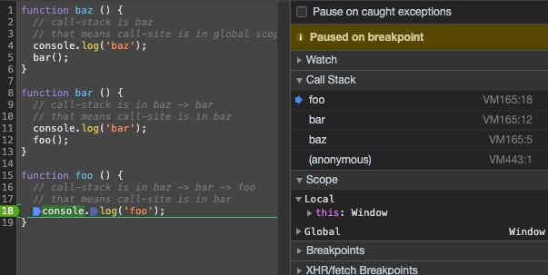
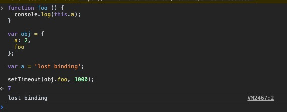

# `this` 看上去是那么回事了！(`this` All Makes Sense Now!)
之前提及 `this` 的绑定取决于函数调用时的调用条件，即函数如何被调用 —— **调用点(call-site)**。

## 调用点(Call-site)
所谓 *调用点(call-site)*，即代码中函数调用的位置(区别函数声明的位置)。但仅仅通过 *定位函数的调用位置* 来找到 *调用点* 并不那么有效，因为有些书写代码的模式会将其掩盖起来。

另一个重要的概念是 *调用栈(call-stack)* —— 当前函数 *执行时* 的已调用的栈。

👇 *调用点* 和 *调用栈*：
```js
function baz () {
  // call-stack is baz
  // that means call-site is in global scope
  console.log('baz');
  bar();
}

function bar () {
  // call-stack is in baz -> bar
  // that means call-site is in baz
  console.log('bar');
  foo();
}

function foo () {
  // call-stack is in baz -> bar -> foo
  // that means call-site is in bar
  console.log('foo');
}

baz(); // the bar call-site
```

从 *调用栈* 中分析出 *调用点* 是为了获取 `this` 的绑定，你可以使用浏览器自带的debugger工具，或者直接在代码里插入 `debugger`，来在 `foo` 函数的位置打断点，而后在可视化的图形界面中查看👆这段代码真实的调用栈(右侧第二行的Call Stack)：



## 规定，不是乌龟的屁股(Nothing But Rules)
想要知道 `this` 的绑定指向，我们必须先查看 *调用点*，并根据 **4** 个既定的规则来知晓 `this` 的真实指向。

### 默认绑定(Default Binding)
第一个场景是我们最为熟知的，即 *单独地调用某个函数(standalone function invocation)*。你可以把这个规则理解成其他绑定规则都没生效时，对于 `this` 绑定的 缺省/默认规则。

```js
function foo () {
  console.log(this.a);
}

var a = 2;

foo(); // 2
```

👆 全局的变量声明 `var a = 2;` 实际上同等于在 *全局对象(global-object)* 中加入了一个属性值 `a` —— 它们不是互为复制品，它们就是彼此，它们是一个硬币的两面，区别仅在于看问题的角度不同而已。

紧接着，我们调用函数 `foo` 而后执行其中的代码块 `console.log(this.a);` 获取到了变量 `a` 的值并将结果打印在控制台上。为什么 `this.a` 能够获取变量 `a` 的值？ —— 我们先查看 *调用点(call-site)*，发现对于函数 `foo` 是 *单独调用* 的，则可以确认应用的是默认绑定规则，因此这时候的 `this` 绑定的是全局对象。

但如果，我们使用了 *严格模式(strict mode)* —— `"use strict";`，`this` 的默认绑定的 *全局对象* 则会被替换成 `undefined`。

```js
function foo () {
  "use strict";

  console.log(this.a);
}

var a = 2;

foo(); // TypeError
```

有个重要的细节点：`this` 的绑定规则虽然基于 *调用点*，全局对象也只会在默认绑定规则且没有运行在 *严格模式* 才会绑定到 `this` 上。但在 *调用点* 上声明的 *严格模式*，并不能决定在这个点上调用的函数是否都遵循 *严格模式*：

```js
function foo () {
  console.log(this.a);
}

var a = 2;

(function () {
  "use strict";

  foo(); // 2
})();
```

### 隐式绑定(Implicit Binding)
另一个 `this` 的绑定规则需要关注：函数的 *调用点* 是否有 *上下文对象(context object)*；换句话说，*调用点* 是否拥有或包含某个对象：
```js
function foo () {
  console.log(this.a);
}

var obj = {
  a: 2,
  foo
}

obj.foo(); // 2
```

首先，无论函数 `foo` 是提前声明而后被加入到对象 `obj` 中的，还是 `foo` 伴随对象初始化时才一并声明，这都不是重点。重点是函数 `foo` 被 `obj` 所包含，当然你也可理解成对象 `obj` 保存了对函数 `foo` 的引用指针。

`obj.foo();` 在函数 `foo` 调用之前还有一个对于 `obj` 的引用，这个 `obj` 就是之前提到的 *上下文对象*。而这正好符合 `this` 的 *隐式绑定* 规则 —— `this` 绑定到函数引用的对象 `obj` 上，因此 `this.a` 指代的就是 `obj.a`。

多层引用时，只有最后一层的对象引用才会绑定到 `this` 上：
```js
function foo () {
  console.log(this.a);
}

var obj2 = {
  a: 42,
  foo
};

var obj1 = {
  a: 2,
  obj2
};

obj1.obj2.foo(); // 42
```

#### 隐式绑定的丢失问题(Implicitly Lost)
一个常见的令人困惑在于 `this` 的隐式绑定会丢失，并退回到默认绑定规则，即 `this` 要么指向全局对象，要么是 `undefined`，这取决于是否应用了 *严格模式*👇：

```js
function foo () {
  console.log(this.a);
}

var obj = {
  a: 2,
  foo
};

var bar = obj.foo;

var a = 'lost binding';

bar(); // "lost binding"
```

👆虽然变量 `bar` 显然是对 `obj.foo` 的引用，但是关键点还是在于 *调用点* —— `bar();` 显然是一个没有任何 *上下文对象(context object)* 的函数调用，因此使用了默认规则也不足为奇了。

*回调函数* 是另一个更微妙、更普遍、更反预期的丢失隐式绑定的场景👇：

```js
function foo () {
  console.log(this.a);
}

var obj = {
  a: 2,
  foo
};

function doFoo (callback) {
  callback && callback();
}

var a = 'lost binding';

doFoo(obj.foo); // "lost binding"
```

👆向 `doFoo(obj.foo);` 传递参数时，虽然 `obj.foo` 是有对象的引用，但函数并没有被调用，此时并不是我们提到的 *调用点*。真正的 *调用点* 还是 `callback && callback();` —— 没有涉及任何的 *上下文对象(context object)*。

你可能会想，如果我使用内建的方法接受回调的方法，是否情况有所改变呢？：

```js
function foo () {
  console.log(this.a);
}

var obj = {
  a: 2,
  foo
};

var a = 'lost binding';

setTimeout(obj.foo, 1000); // "lost binding"
```



答案显然是 **依然会丢失** —— 关键依然是在 *调用点* 上。

### 显示绑定(Explicit Binding)
了解了默认绑定和隐式绑定的规则后，有一部分的 `this` 指向场景能满足我们的需求了，但如果我们想要强制将某个函数的 `this` 绑定到某个 *上下文对象* 上，而又不想将这个函数作为这个 *上下文对象* 的某个方法来调用，这时候就需要使用 *显示绑定* 规则了。

`call(…)` 和 `apply(…)` 是每个函数都具备的内置方法，它们的使用基本类似，第一个参数都是绑定到 `this` 的 *上下文对象*，后面的则是调用该方法(`call` 和 `apply`)的函数所需要的参数，完成这些后，立即执行这个函数：

```js
function foo () {
  console.log(this.a);
}

var obj = {
  a: 2
};

foo.call(obj); // 2
```

如果你将 *原始值(primitive value)*(`string`、`number`、`boolean`) 作为第一个参数传入 `call` 或 `apply`，那么这些原始值将会被隐式转换成 *包装对象*(`new String(…)`、`new Number(…)`、`new Boolean(…)`)。

但好像显示绑定也并没有解决隐式绑定丢失 `this` 的问题？！

#### 硬绑定(Hard Binding)
围绕着显示绑定实现的一种绑定模式，能够解决丢失 `this` 的问题：

```js
function foo () {
  console.log(this.a);
}

var obj = {
  a: 2
};

var a = 'lost binding';

function bar () {
  foo.call(obj);
}

setTimeout(bar, 1000);

bar.call(window);
```

👆函数 `bar` 无论是作为回调函数，还是自身的 `this` 被显示的绑定到全局对象(`window`)，调用它都只会在控制台打印出 `2` 即 `obj.a` 的值 —— 因为其内部只会将 `foo` 的 `this` 显示的绑定到 `obj` 上。这样的绑定模式我们称为 *硬绑定*。

改进一下，你可以将需要进行硬绑的函数和 *上下文对象* 作为参数传递：

```js
function foo (num) {
  console.log(this.a, num);

  return this.a + num;
}

function simpleBind (fn, ctx) {
  return function () {
    return fn.apply(ctx, arguments);
  }
}

var obj = {
  a: 2
};

var a = 'lost binding';

var bar = simpleBind(foo, obj);

var b = bar(5); // 2 5
console.log(b); // 7
```

👆上面代码中的 `simpleBind` 是内置的 `bind` 方法的部分功能简单实现，内置的 `bind` 方法不仅能够返回一个已经为 `this` 绑定了 *上下文对象* 的函数，并且这个函数还有一个 `name` 属性的值为 `bound foo`，即绑定了 `this` 的函数 `foo`。

#### API调用的 “上下文”(API Call "Context")
很多第三方库的方法，甚至是一些内置的方法，提供了可选参数，这个参数会让你传递 *上下文对象* 来绑定到回调函数 `this` 上：

```js
function foo (ele) {
  console.log(ele, this.id);
}

var obj = {
  id: 'awesome'
};

[1, 2, 3].forEach(foo, obj); // 1 "awesome" 2 "awesome" 3 "awesome"
```

从本质上来说，这些方法都采用了显示绑定的规则，即使用 `call` 和 `apply` 内置方法来帮你避免一些麻烦。

## `new` 绑定(`new` Binding)
第四个，也是最后一个 `this` 的绑定规则，需要我们重新思考JS中的函数和对象，以及关于它们常见的误区。

在传统的面向对象的语言中，通常使用关键字 `new` 来实例化一个类，这个关键字在JS中也同样存在。但JS中使用关键字 `new` 虽然看上去跟面向对象的语言一样，好像都实例化了一个类，但这只是一个假象。

首先，JS中所谓的 *构造器(constructor)* 只是一个函数，在其前面使用了关键字 `new` 来调用它而已。它并非一个类，也不是实例化这个类，它甚至都不是一个特殊的函数 —— 除了使用 `new` 来 *劫持(hijacked)* 它的调用，它本质上和普通的函数没什么两样。

比如，内置的 `Number(…)` 构造函数，在ES5的说明文档里，对其有清晰的定义：
> 15.7.2 The Number Constructor
> 
> When Number is called as part of a new expression it is a constructor: it initialises the newly created object.

JS中并没有所谓的 *构造器函数(constructor functions)*，只有 *函数的构造调用(construction calls of functions)*。

当函数前使用了 `new` 关键字时，发生了如下的事情：
1. 凭空创造了新对象，并将其关联到 *原型(prototype)* 上；
2. 这个新对象被绑定为这个函数中的 `this` 的 *上下文对象*；
3. 除非函数手动的返回一个对象，否则就这个新创建的对象会被返回。

```js
function foo (a) {
  this.a = a;
}

var bar = new foo(a);

console.log(bar.a); // 2
```

`new` 是函数调用时能够绑定 `this` 的最后一种方式，我们称其为 *new 绑定*。

## 一切都井然有序(Everything In Order)
如果只有一种 `this` 绑定的规则，那一切尽在不言中。而现实是我们往往会面临多种绑定规则一起出现，这时候次序，或者说权重就显得很重要了。

一个显而易见的情况是，*默认绑定规则(default binding)* 肯定是优先级最低的情况，因此先比较 *隐式绑定(implicit binding)* 和 *显示绑定(explicit binding)*：

```js
function foo () {
  console.log(this.a);
}

var obj1 = {
  a: 3,
  foo
};

var obj2 = {
  a: 2,
  foo
};

obj1.foo(); // 3
obj2.foo(); // 2

obj1.foo.call(obj2); // 2
obj2.foo.call(obj1); // 3
```

👆很显然，从 `obj1.foo.call(obj2);` 会输出 `3` 的结果来看，*显示绑定* 的优先级高于 *隐式绑定*。

👇接下去是 *隐式绑定(implicit binding)* 和 *new 绑定(new binding)*：

```js
function foo (num) {
  this.a = num;
}

var obj1 = {
  foo
};

var obj2 = {};

obj1.foo(2);
console.log(obj1.a); // 2

obj1.foo.call(obj2, 3);
console.log(obj2.a); // 3

var bar = new obj1.foo(4);
console.log(obj1.a); // 2
console.log(bar.a); // 4
```

很显然，`bar.a` 的值是 `4`，因此 *new 绑定* 优先级高于 *隐式绑定*。

**Note:**