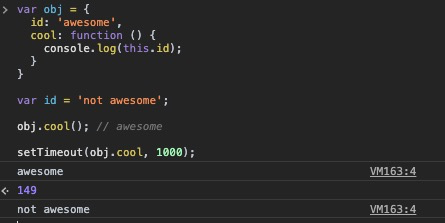
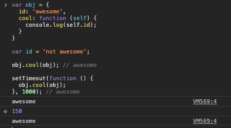
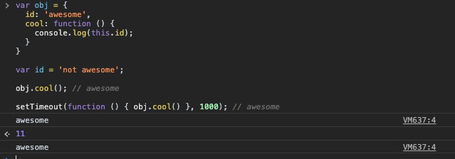
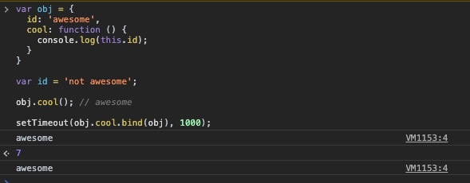
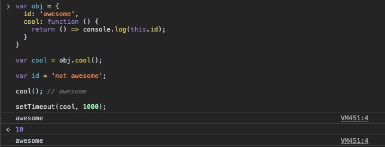

# 附录C：词法-this(Lexical-this)
ES6中，新增了一种叫做 *箭头函数(arrow function)* 的函数声明方式：
```js
var foo = a => {
  console.log(a);
};

foo(2); // 2
```

👆 `=>` 被称为 *粗体箭头(fat arrow)*，通常被认为是替代冗长的关键字 `function` 的缩写。但是显然有一些比节省键盘敲击次数更重要的事 —— 解决 `this` 的问题：

```js
var obj = {
  id: 'awesome',
  cool: function () {
    console.log(this.id);
  }
}

var id = 'not awesome';

obj.cool(); // awesome

setTimeout(obj.cool, 1000); // not awesome
```



👆在 `setTimeout` 里面执行关于 `obj.cool` 的回调函数时，发现 `this.id` 获取的值是全局作用域中 `var id` 的值；产生这个问题的根源是在回调函数中丢失了对于 `this` 的绑定。

----

想要解决这个问题，通常的做法是利用词法作用域的特性，将 `this` 用变量/参数 `self` 来代替：

```js
var obj = {
  id: 'awesome',
  cool: function (self) {
    console.log(self.id);
  }
}

var id = 'not awesome';

obj.cool(obj); // awesome

setTimeout(function () {
  obj.cool(obj);
}, 1000); // awesome
```



👆显然，这是回避了 `this` 指向的问题，转而用词法作用域来解决 —— `self.id` 本质上就是通过 *RHS* 进行词法作用域的查找，将 `obj` 作为参数传入，因此在 `setTimeout` 中，`obj.cool` 取得的值就是 `obj.id` 的值，而非全局变量 `id` 的值。

或者：
```js
var obj = {
  id: 'awesome',
  cool: function () {
    console.log(this.id);
  }
}

var id = 'not awesome';

obj.cool(); // awesome

setTimeout(function () { obj.cool() }, 1000); // awesome
```



👆同样，这也是利用了词法作用域的规则，但是函数 `cool` 的 `this` 是被隐式的绑定在调用它的对象 `obj` 上。

----

另一种比较靠谱的解决方案是使用 `bind` 显示的绑定 `this` 的指向👇：

```js
var obj = {
  id: 'awesome',
  cool: function () {
    console.log(this.id);
  }
}

var id = 'not awesome';

obj.cool(); // awesome

setTimeout(obj.cool.bind(obj), 1000); // awesome
```



----

而箭头函数的出现，在一定程度上简化了使用 `this` 的难度，比如上述问题可以这样得到解决👇：
```js
var obj = {
  id: 'awesome',
  cool: function () {
    return () => console.log(this.id);
  }
}

var cool = obj.cool();

var id = 'not awesome';

cool(); // awesome

setTimeout(cool, 1000); // awesome
```



👆显而易见的是，箭头函数和普通函数在处理 `this` 时有不一样的机制，前者显然是在书写的时候(`var cool = obj.cool()`)，其内部返回的函数 `() => console.log(this.id)` 就绑定了 `this` 的指向为 `obj`，而不是等到调用的时候再去根据一定的规则获取 `this`。