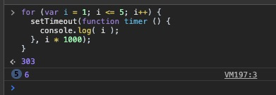
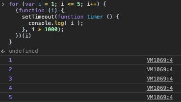
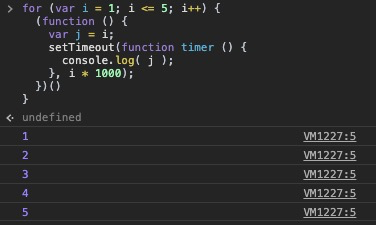
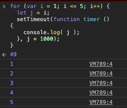
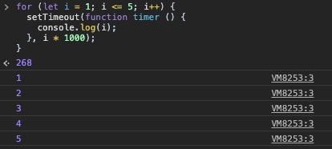

# 作用域和闭包(Scope Closure)

## 悟道(Enlightenment)
对于 *闭包(closure)* 这个概念，有很多即便是有经验的JS开发者也不能够完全掌握。若要理解 *闭包*，似乎需要经历一次涅槃重生 —— 一个人必须很努力还要付出牺牲才能达到。

**闭包在JS中无处不在，你必须认识它、拥抱它**。闭包很有可能出现在你写的一段依赖于作用域的代码中，你甚至都不知道你使用了它，但它就在那里，等待你去认识它、拥抱它、利用它。

悟道时刻应该是：**闭包已经在我的代码中出现了，我终于能够看见它了！**。第一次理解闭包就如同第一次看见电影《黑客帝国》中的 *Matrix* 一样。

## 本质(Nitty Gritty)
*闭包* 的本质是：某个函数能够记住并且能访问到某个 *词法作用域(lexical scope)*，即便是这个函数是在该词法作用域范围之外运行的时候。

```javascript
function foo () {
  var a = 2;

  function bar () {
    console.log(a); // 2
  }

  bar();
}

foo();
```

👆函数 `bar` 能够通过词法作用域获取变量 `a`，这属于之前提到的 *RHS* 查询，这个规则实际上也属于 *闭包* 的一部分。从学术角度来看，函数 `bar` 保有一个覆盖了函数 `foo` 的作用域的 *闭包*。但以这个例子来展示 *闭包* 显然不够清晰，它依然是一个神秘的影子。

👇更清晰的 *闭包*：
```javascript
function foo () {
  var a = 2;

  function bar () {
    console.log(a);
  }

  return bar;
}

var baz = foo();

baz(); // 2
```
函数 `bar` 能够访问函数 `foo` 中的作用域，而后我们将函数 `bar` 作为 `foo()` 调用的返回值返回，并将其赋值给变量 `baz`。当我们调用 `baz()` 时，执行的作用域显然是在函数 `foo` 的作用域之外的，当却能访问到函数 `foo` 内部的变量 `a`。

我们都知道JS引擎的 *垃圾回收器(Garbage Collector)* 会定时的释放一些不再使用的内存，理论上函数 `foo` 在执行完毕后，表面上看其内容都不会再被使用了，因此其内部的作用域都应该被回收掉，但神奇的是这一幕并没有发生。那到底是谁还在使用它？答案是 **函数 `bar` 自己**。

函数 `bar` 一直保持对那个作用域的 *引用(reference)* 本身，就是所谓的 *闭包(closure)*。

由此可见，*闭包* 的功能之一就是 **能让函数持续的访问在书写代码时定义的词法作用域**，换句话说 **闭包能让函数访问 *在当前无法通过词法作用域访问* 的作用域**。

*闭包* 并非一定要将函数作为值返回，比如将函数作为参数使用：
```javascript
function foo () {
  var a = 2;

  function bar () {
    console.log(a)
  }

  baz(bar);
}

function baz (fn) {
  fn && fn();
}
```

或者将函数保存在某个变量中，而后再调用：
```javascript
var fn;
function foo () {
  var a = 2;

  function bar () {
    console.log(a)
  }

  fn = bar;
}

function baz (fn) {
  fn && fn();
}

foo ();

baz();
```

👆但其本质依然是保持某个函数对其能访问的作用域的引用。

## 如何观察(How I Can See)
*闭包* 无处不在：

```javascript
function wait (msg) {
  setTimeout(function () {
    console.log(msg);
  }, 1000)
};

wait('I am a test message');
```

👆在 `wait` 中的 `setTimeout` 形成了一个 *闭包*，而这个 *闭包* 能保持对变量(函数的参数) `msg` 的访问 —— 在执行完 `wait` 的1000毫秒后，函数 `wait` 的内部作用域，按道理讲应该已经被垃圾回收了，但传入进 `setTimeout` 的回调函数依然能访问 `msg` 变量。

### 闭包(closure)
定时器、事件处理、Ajax请求、web worker、跨Tab页交互……无论是同步还是异步，只要你传入了回调函数 `callback`，你不得不准备好迎接 *闭包* 的到来。

**注意(Note)**：*IIFE* 模式实际 *并非* 是一个观察 *闭包* 的好例子：
```javascript
var a = 2;

(function () {
  console.log(a);
})();
```
👆在 *IIFE* 中，对于变量 `a` 的 *RHS*，实际上是通过正常的词法作用域来查找的，而非通过 *闭包*。

虽然 *IIFE* 自身并不能成为一个 *闭包* 的例子，但是它创建了一个局部作用域，这个作用域和闭包有着千丝万缕的关系。

## 循环 + 闭包(Loop + Closure)
*for循环* 是经典的展示 *闭包* 的例子：
```javascript
for (var i = 1; i <= 5; i++) {
  setTimeout(function timer () {
    console.log(i);
  }, i * 1000);
}
```



👆和期待打印出 `1`，`2`，`3`，`4`，`5` 相反，这段代码只会打印出5个 `6` —— 这是因为当变量 `i` 大于 `5` 时才会停止 *for循环* ，这个时候 `i` 的值是 `6`，而执行了5次的 `setTimeout` 中的回调函数，它们实际上只共享一个全局作用域，这个作用域包含了变量 `i`(值为6) —— 这其实和写5次 `setTimeout(…)` 没有本质的区别，千万别让循环语句迷惑了你！

如果我们就是想要打印出 `1`，`2`，`3`，`4`，`5` 呢？那就要用到更多的 *闭包* 了：
```javascript
for (var i = 1; i <= 5; i++) {
  (function (i) {
    setTimeout(function timer () {
      console.log(i);
    }, i * 1000);
  })(i)
}
```



或者是：
```javascript
for (var i = 1; i <= 5; i++) {
  (function () {
    var j = i;
    setTimeout(function timer () {
      console.log(j);
    }, i * 1000);
  })()
}
```



### 块级作用域重游(Block Scoping Revisted)
*IIFE* 可以在每次遍历的时候创建一个 *闭包*(本质上是一个记录了当前作用域范围的新的作用域)，但如果想要用块级作用域实现一样的功能呢：
```javascript
for (var i = 1; i <= 5; i++) {
  let j = i;
  setTimeout(function timer () {
    console.log(j);
  }, j * 1000);
}
```



👆 *for循环* 的每一次遍历，本质上都是创建了一个块级作用域，而每一次遍历，使用 `let` 声明的变量 `j` 只能被当前的块作用域访问到，因此在 `console.log(j);` 语句执行 *RHS* 查询时，首先找到的是该块级作用域中声明的变量 `j`，它的值就是每次声明时，用 `i` 对其进行赋值的值。

但是请等等，还没完：
```javascript
for (let i = 1; i <= 5; i++) {
  setTimeout(function timer () {
    console.log(i);
  }, i * 1000);
}
```



👆这样的现象说明了一个事实：在 *for循环* 头部用 `let` 声明的变量，是属于每一次遍历迭代的块级作用域的。并且上一次迭代的值(经过 `i++` 后)，都会被赋值给这一次的变量声明。

## 模块(Modules)
另外一种用到 *闭包(closure)* 的代码涉及模式并未使用 *回调函数(callback)*，它叫 *模块(module)*。