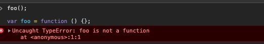
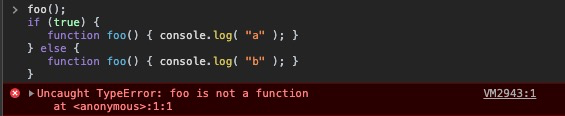

# 提升(Hoisting)
对于函数作用域和块级作用域的规则 —— *任何在这些作用域中声明的变量，都会附定(attach)到这个作用域上* —— 上一章已经讨论较为充分了。但还有一些关于作用域中如何处理附定工作的细节，还需要再看看。

## 先有鸡还是先有蛋?(Chicken Or The Egg?)
如果你认为JS运行代码是一行接一行，自上而下的顺序，虽然基本没错，但可能会带来认知的误区：
```javascript
a = 2;

var a;

console.log(a); // 2
```
👆很多开发者都以为打印的结果应该是 `undefined`，但实际上会输出 `2`。

👇下面的输出结果中，有人认为是 `2`，还有人认为是 `ReferenceError`，但实际上是 `undefined`：
```javascript
console.log(a); // undefined

var a = 2;
```

## 编译器又来了(The Compiler strikes Again)
在前面提到过，在编译阶段，编译器有一部分的工作就是将所有的 *声明(declarations)* 附定到与之对应的作用域中，而这正是词法作用域的核心所在。因此不妨这样想问题：无论是变量还是函数的声明，都会在它们执行之前处理好。

比如 `var a = 2;` 这样的语句，在JS看来它被分成了两部分 —— `var a` 和 `a = 2;`。第一部分 `var a` 会在编一阶段完成，后面的部分则要留到执行阶段。

上述的特性，即变量和函数的声明会早于它们的执行，被称为 **提升(Hoisting)**。这也回答了👆 *先有鸡还是先有蛋* 的问题 —— 蛋(声明)先于鸡(执行)出现。

```javascript
foo ();

function foo () {
  console.log(a); // undefined

  var a = 2;
}
```
👆函数 `foo` 的声明被提升了，并且它的值也随之提升。变量 `a` 的声明提升了，但是对它进行的赋值操作依然要等到执行 `var a = 2;` 时才会进行，也因此它的值是 `undefined`。

```javascript
foo(); // TypeError

var foo = function () {};
```


👆报错信息是 `TypeError`，证明变量 `foo` 的确是声明了，否则应该是提示 `ReferenceError`；但变量的赋值还未发生，因此 `foo` 在执行的时候并不是一个函数，所以有 `TypeError` 这个错误。

简单来说，*函数声明(function declarations)* 能够提升值，*函数表达式(function expressions)* 只能提升其变量名。

```javascript
foo(); // TypeError
bar(); // ReferenceError

var foo = function bar() {};
```
👆上面的代码片段可等效于👇：
```javascript
var foo;

foo(); // TypeError
bar(); // ReferenceError

foo = function () {
  var bar = foo;
};
```

## 函数声明优先(Functions First)
函数和变量的声明都能提升，且函数的提升在前，而后才是变量的提升：
```javascript
foo(); // 1

var foo;

function foo () {
  console.log(1);
}

foo = function () {
  console.log(2);
}
```
👆需要注意的是 `var foo;` 是重复声明(被忽略了)，并且是出现在函数 `foo` 声明之前，而调用 `foo();` 控制台打印的是 `1` 并不是 `TypeError`。这足以说明函数的提升早于变量的提升。

👇 *函数重载*，即用相同的变量名重复声明函数，会导致最后声明函数覆盖掉前面所有同名的函数声明或函数表达式：
```javascript
foo (); // 3

function foo () {
  console.log(1);
}

var foo = function () {
  console.log(2);
}

function foo () {
  console.log(3);
}
```

如果是在块级作用域中进行函数声明要小心，在有些宿主环境下只能提升函数的变量名：
```javascript
foo(); // TypeError

if (true) {
  function foo() { console.log(1); }
} else {
  function foo() { console.log(2); }
}
```


## 回顾(Review)
如 `var a = 2;` 这般的语句会被JS引擎分成两部分：`var a` 和 `a = 2;`；前者是在编译阶段发生，后者出现在执行阶段。

所有函数和变量的声明都会在编译阶段被处理，也就是所谓的 *提升(Hoisting)*。

要警惕重复声明带来的潜在危害，特别是当一个变量既用于函数声明还用于变量名时。