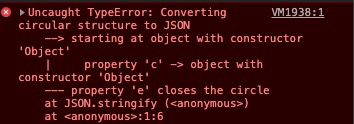
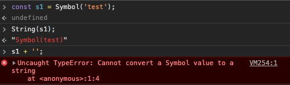
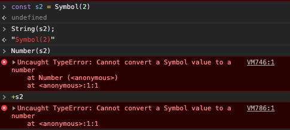

# 类型转换(Coercion)

## 强制转换(type casting/conversion) VS 隐式转换(type coercion)
- 最大的区别在于 强制转换一般是静态类型的语言发生在编译时(compile time)，隐式转换一般是动态类型的语言发生在运行时(runtime)
- 对于JS来说, 关于显示和隐式转化，并没有清晰的定义。但通常来讲，如果你清晰的知道某个写法会被coercion，那对你而言，这就是显示转换

----

## JS中的抽象运算(abstract operation / internel-only operation)

### ToPrimitive
使用valueOf(...) & toString(...)
将复杂类型转换成原始类型，valueOf的有限级高于toString，如果两个方法都不可用，会抛出TypeError
```javascript
var a = Object.create(null);
+a; // TypeError
```

### ToString
- 原始值变成string，基本都是添加引号的过程''
- 特别大的数字转换成string时会以指数的形式表示数字，然后再转成string
#### toString(...)
- 常规的对象转成string，一般都是调用Object.prototype.toString的方法，返回带有类的字符串
- 如果对象自定义了toString方法，那么当对象被用于字符串相关的操作时，会自动调用这个自定义的方法，并返回定义的值
- 总而言之，toString能够显示调用，也会在非string的值在被用于需要string的上下文中被调用
#### String(...)
- 不带关键字`new`调用String方法会显示的将传入的值转换成字符串
#### JSON.stringify(...)
- 一般讲，序列化(stringification)的行为和toString类似，但是操作已经是字符串的值时，序列化会再添加引号
  ```javascript
  JSON.stringify('123'); // ""123""
  ```
- 关于JSON-safe
  * 有效的JSON值即为JSON-safe
  * 非JSON-safe
    1. undefined
    2. function
    3. symbol
    4. object with circular references - 循环引用
  * 对于非 JSON-safe的值
    + 如果出现在数组中，会被转换成null
    ```javascript
    JSON.stringify([1, undefined, function () {}, 55]); // [1, null, null, 55]
    ```
    + 如果出现在对象中，会直接被省略
    ```javascript
    JSON.stringify({
      a: 1,
      b: function () {},
      c: undefined
    }); // {a: 1}
    ```
    + 直接转化，则都为undefined
    ```javascript
    JSON.stringify(function () {}); // undefined
    ```
    + 如果出现循环引用，会报错
    ```javascript
    var o = {};
    var a = { b: 33, c: o, d: function () {} };
    o.e = a;
    JSON.stringify(a); // TypeError ...
    ```
    
  * toJSON
    + 如果一个对象定义了toJSON的方法，那么在做序列化的过程中，这个方法会被唤起并决定哪些值会被序列化
    ```javascript
    var a = { b: 33, c: o, d: function () {} };
    a.toJSON = function () {
      return { b: this.b };
    };
    JSON.stringify(a); // "{"b": 42}"
    ```
    + toJSON 返回的值并不需要序列化，返回正常类型值即可，因为最后的步骤还是需要交给JSON.stringify, 而toJSON只是决定了那些值会被序列化 —— 因此toJSON被翻译成 'to a JSON-safe value suitable for stringification' 更合适
  * JSON.stringify 接受第二个参数，可以是一个数组或一个函数
    + 序列化一个对象时，第二参数传递的数组里面指定的键会被序列化，而未被指定的则跳过，如果该键不存在，也跳过
    ```javascript
    var a = { b: 22, c: 33, d: [4,5,6] };
    JSON.stringify(a, [b, c]);
    ```
    + 序列化一个对象，第二个参数是函数时，会遍历这个对象，并在函数里面接受key和value的参数，返回其值则代表进行序列化，对于不想序列化的键，返回undefined即可
    ```javascript
    var a = { b: 22, c: 33, d: [4,5,6] };
    JSON.stringify(a, function (k ,v){
      console.log(k);
      if (k !== 'c') return v;
    });
    // 可以观察到，第一次k是undefined，这是因为遍历的是a对象自身；
    // 而后续还会打印0 1 2，这是递归d数组，取其索引为k导致的
    ```
  * JSON.stringify 的第三个参数能格式化输出
    + 如果传入一个数字，则代表有多少个空格会被用于每一个缩进级别
    ```javascript
    var a = {b: 22, c: 33, d: [4,5,6]};
    JSON.stringify(a, null, 3);
    ```
    + 如果传入一个字符，那么该字符的前十个(如果有那么多)会被作为缩进
    ```javascript
    var a = {b: 22, c: 33, d: [4,5,6]};
    JSON.stringify(a, null, '-----');
    ```

### ToNumber
#### Number(...)
```javascript
true --> 1
false --> 0
undefined --> NaN
null --> 0
'' --> 0
[] --> 0
[''] --> 0
[5] --> 5
['5'] --> 5
['a'] --> NaN
[1, 2] --> NaN
```

### ToBoolean
#### Boolean(...)
- **falsy** - the value will coerce to false
  ```javascript
  undefined
  null
  false
  +0 -0
  NaN
  ''
  ```
- **truthy** - anything not explicitly on the falsy list is therefore truthy
- 看下面两段代码, 体会下通过*包装对象*进和*字面量*行转换后的值的区别
  ```javascript
  var a = new String('');
  var b = new Number(0);
  var c = new Boolean(false);

  var d = Boolean(a && b && c);
  d; //true
  var e = a && b && c;
  e; // String ''
  ```

  ```javascript
  var a = "''";
  var b = '0';
  var c = 'false';

  var d = Boolean(a && b && c);
  d; //true
  ```
- **falsy object**
  ```javascript
  document.all; // 为了区别老旧的IE浏览器，大部分现代浏览器都将document.all 隐式转换成boolean值的时候置为false
  !!document.all; // false
  ```

----

## 显示转换(Explicit Coercion)
### String <--> Number
#### 使用built-in native constructors(但是不加关键字new，意味着不实例化产生包装对象)
```javascript
var a = 32;
var b = String(a);

var c = '123';
var d = Number(c);
```

#### 使用toString()方法、+号、-号运算符进行转换
```javascript
var a = 32;
var b = a.toString();
var b1 = '' + a;

var c = '123';
var d = +c;
// toString()方法表面上看起来是显示转换，但是32.toString()显然会报错，而a.toString()是将a先用对象包裹起来，然后进行调用，可以理解为显示中的隐式转换
```

```javascript
var a = '3';
var b = 5+ +a;

b; //8
```

```javascript
var c = '7';
var d = - -c;

d; //7
```

```javascript
var a = '4';
var b = 5;

b =+ a ; //4
b += a; //'54'
```

```javascript
var a = 4;
var b = '5';

a +++b; //'45'
a; // 5
b; // '5'

a + ++b; // 10
a; // 4
b; // 6

a + + +b; // 9
a; // 4;
b; // '5'
```

#### parseInt(...) 和 parseFloat(...)
```javascript
parseInt('42px'); // 42
```
- 和Number(..)不同，parseInt(...)不会关心字符串整体是否是数字字符(numeric characters)，它只会从左往右找到数字字符进行转换
- 如果以0X或0x开头，会被认为是16进制转换为10进制，如果以0开头，则会认为是8进制转换成10进制
  * 因此对于时间的转换(时分秒)，需要使用第二个参数，即指定转换的进制数(radix)
  * 在ES5以后，默认不会有8进制的转换，只有10和16进制，因此只需要注意在ES5以前的环境中使用parseInt转换0开头的字符数字即可
  ```javascript
  parseInt(1/0, 19); // 18
  parseInt('b'); // NaN
  parseInt('b', 12); // 11
  // base-19，有效的数字字符是0-9和a-i，因此 1/0 --> Infinity 第一个字符i会被解析，遇到第二个字符n则会停止，因此最终的结果是18
  ```

  ```javascript
  parseInt( 0.000008 ); //0
  parseInt( 0.0000008 ); //8 (0.0000008 --> 8e-7)
  parseInt( false, 16 ); //250
  parseInt( Array.prototype.map, 16 ); //15 ('f' from 'function')
  parseInt( "0x10" ); //16
  parseInt( "103", 2 ); //2
  ```

### Date <--> Number
```javascript
let timestamp = +new Date();
timestamp = +new Date;
timestamp = new Date().getTime();
timestamp = Date.now()
```

### bitwise operators (位运算符)
- 位运算符在JS中只支持`ToInt32`规则，如果超过了32-bit，则运算的结果会被coercion成32位的数字
- `~` 运算符先将操作数转换成32-bit的数字，然后按位求反(performs a bitwise negation) —— 翻转奇偶性(flipping each bit's parity)
  * -1 常被用作标记值，使用 ~-1 会得到0，而这个falsy 值能够被coercion, 因此在写法上能够更语义化
  * `~~` 连续使用两个按位非运算符，能够实现截断数字，使之成为整型类型，并且保留正负号；
但是它和Math.floor()有很大区别，前者是按照32-bit规则去执行运算的，后者则满足64-bit的标准；并且在对负数进行截断(truncate)时，~~表现的结果和Mathi.ceil一致
  ```javascript
  var a = Math.pow(2, 32) + 0.55;

  ~~a; //0
  Math.floor(a); // 4294967296

  var b = -49.6;

  ~~b; //-49
  Math.floor(b); // -50
  Math.ceil(b); // -49

  //使用按位或 | 也能实现相同的效果
  var b = -49.6;
  b | 0; // -49
  ```

### * --> boolean
- Boolean(...); 不带new关键字使用内建的方法，虽然很“显”(explicit)，但是并不常用
- unary `!` 操作符 更为常用
- `?:` 三元运算符、`if(...)` 会将条件参数隐式转化成boolean

----

## 隐式转换(Implicit Coercion)
+ JS implicit coercion的目的是: 减少冗余的、样板文件、不必要的执行细节，避免代码被各种噪声转移注意，更清晰的显示代码本来的意图
+ 某些场景下省略或者抽离类型转换的细节，反而有助于代码的阅读性
+ JS的隐式转换总会把值变成原始类型的值，而非复杂类型的值

### String <--> Number
1. `+` 运算符
    ```javascript
    [1,2] + [3,4]; // '1,23,4'

    {a: 1} + {b: 2}; // '[object Object][object Object]'
    ```
    - 根据ES5 spec, + 运算符如果遇到了一个及以上string类型的操作数，会自动进行字符串拼接
    - 如果操作数有对象时，会先将对象valueOf(...)转换成数字, 但默认的valueOf方法不会成功转成原始值, 因此最终会调用toString(...)的方法转换成原始值字符串

    ```javascript
    [] + {}; // '[object Object]'

    {} + []; // 0
    ```

    ```javascript
    "" + 3; // "3"
    ```
  - "" + 3; 和 String(3); 的区别是：前者先调用valueOf(...)方法，然后将其值转换成字符串，后者则是直接调用toString(...)方法

    ```javascript
    var a = {
      valueOf: function () { return 42; },
      toString: function () { return 2; }
    };

    a + ''; // '42'
    String(a); // '2'
    ```

    ```javascript
    var a = "3";
    var b = +a;

    b; // 3
    ``` 

2. `- * /` 运算符
    ```javascript
    var a = '3.14';
    var b = a - 0;
    var c = a * 1;
    var d = a / 1;

    b; // 3.14
    c; // 3.14
    d; // 3.14
    ```

    ```javascript
    var a = [3];
    var b = [1];

    a - b; // 2
    ```
    - 和 + 运算符不同的是，- 运算符不会进行字符串的删减，而会将字符串转换成数字后进行数学运算；

    - 针对**var a = [3];** 先会进行`valueOf(...)`，但是此时的结果不是原始值，然后调用`toString(...)`方法，转换成字符串，最后再转换成数字进行数学运算

### Boolean --> Number
- boolean 到 number 主要是基于 + - * / 等运算符
  ```javascript
  var a = true;
  var b = false;

  a * 33; // 33
  b * 33; // 0
  ```
- number 到 boolean 则是用 ! 运算符
  ```javascript
  var a = 2;
  var b = 0;

  !!a; // true
  !!b; // false
  ```

- 传入任意参数，如果有且只有一个参数是truthy，则返回true，否则返回false
  ```javascript
  function onlyOne () {
    let sum = 0;
    const len = arguments.length;
    for (let i = 0; i < len; i++) {
      sum += !!arguments[i];
    };
    return sum === 1;
  };
  // 利用 += 和 !! 运算符进行隐式转换，先将任意参数通过!!转换成boolean，然后用+=将其转换成数字，true为1, false为0;
  // 则最终sum结果满足1，则说明只有一个传入的值是truthy
  ```

### * --> Boolean
- boolean值隐式转换的触发点
  1. `if (...)`
  2. `for(...; ...; ...;);` 第二个条件
  3. `while(...)` 和 `do...while(...)`
  4. `(...)?(...):(...)` 第一个条件
  5. `||` 和 `&&` 的左侧操作数
- || 和 &&
  * 通常定义为logical operators, 但定义为operand selector operators更为恰当, 因为它们会选择一个(only one)的操作数作为返回值，而不是它们运算的布尔值
    ```javascript
    a || b;
    a ? a : b;

    a && b;
    a ? b : a;
    ```
  * 从结果来看，|| 和 && 与 ?: 三元运算符保持一致；区别在于它们的运行过程，比如a || b 如果a为truthy，那么只会对a进行一次evaluated，如果是a ? a : b，a会进行两次evaluated
  * `&&` 又被称为 `guard operator` 或 `short circuiting`,
  * 虽然`&&` 和 `||`返回的是它们的操作数, 但是在if(...)、while(...) 等语句中, 最终会将它们返回的操作数再一次隐式转换成`boolean`

----

## Symbol的转换(Symbol Coercion)
- 对于转换`string`类型, 能够显示的转换, 但是对其进行隐式转换只会得到错误
  ```javascript
  const s1 = Symbol('test');

  String(s1); // 'Symbol(test)'
  s1 + ''; // TypeError
  ```
  
- 对于转换`number`类型, 都会报错
  ```javascript
  const s2 = Symbol(2);

  Number(s2); // TypeError
  +s2; // TypeError
  ```
  
- 对于转换`boolean`类型, 则都允许
  ```javascript
  const s3 = Symbol(true);

  Boolean(s3); // true
  !s3; // false
  ```

----

## 松比较和严格比较(Loose Equals vs. Strict Equals)
- 一个常见的错误的概念是: `==` 检测的是值相等, `===` 检测值和类型相等...但正确的解释是: `==` 在检测中允许类型转换, `===` 则不允许, 它们都进行了类型检查, 区别只不过是允不允许类型不同而已

- 如果比较的相同类型的值, 那么`==` 和 `===` 使用相同的算法

- 如果比较不同类型的值, 虽然在表现和算法有差异, 但这不是重点(很可能只是几微秒的差距), 关注点应该是你是否想要让比较的值进行隐式转换

### 松比较(==) - 抽象相等(Abstract Equality)
- `==` 操作符的行为被定义为"抽象相等比较算法"(The Abstract Equality Comparison Algorithm)

- ES5 条款11.9.3.1(ES5 spec section 11.9.3)指出: `==` 对于类型相等的原始值比较时, 基本能符合你的预期, 除了: 
  - `NaN == NaN; //false`
  - `-0 == 0; // true`

- `==` 和 `===` 对于复杂类型的值比较时, 不会进行任何的类型转换, 只有当它们的**地址引用**相等时才相等

- `!=` 和 `!==` 的运算过程是先调用 `==` 或 `===`, 然后将结果取反(negation of the result)

#### Comparing - 字符串 vs 数字
- 下面这段代码, 在`a == b;` 中, 到底是a转换成字符串还是b转换成数字?
  ```javascript
  var a = 42;
  var b = '42';

  a == b; // true
  a === b; // false
  ```

- 在ES5 11.9.3.4-5条款中：如果类型是*数字*和*字符*比较, 那么先将**字符转换成数字**, 并不区分在  `==` 运算符的左侧还是右侧

#### Comparing - Anything vs 布尔值
- 根据ES5 11.9.3.6-7条款中声明：如果有一个操作数是的类型是*布尔值*，那么布尔值会被优先**转换成数字**，无论布尔值是在 `==` 的左侧还是右侧
  ```javascript
  var a = '25';
  var b = true;

  /* 下面的表达式运行过程是：
      * 先将 b 转成数字 1
      * 表达式变成了 1 == '25'
      * 类型依旧不同，继续隐式转换
      * 根据 字符串 和 数字 抽象比较的规则
      * 将 字符串转成成数字
      * 表达式变成了 1 == 25
      * 显然它们值不相等，返回false
  */
  a == b; //false
  ```

  ```javascript
  var x = 0;
  var y = 1;
  var z1 = true;
  var z2 = false;

  // 按照上面所述规则，下面的表达式结果也不足为奇了
  x == z2; // true
  y == z1; // true
  ```

- 因此在`if(...)`中使用 `==` 进行判断 *truthy* 或 *falsy* 是不理智的行为，宁肯用 `!!`、`Boolean(...)`代替
  ```javascript
  var a = '22';
  
  // 脑子秀逗了的行为
  if (a == true) {
    // ...
  }; 

  // 正常的做法
  if (a) {
    // ...
  };

  // 显示转换类型，更清晰(冗余)
  if (!!a) {
    // ...
  };
  if (Boolean(a)) {
    // ...
  };
  ```

#### Comparing - `null`s vs `undefined`s
- 根据ES5条款 11.9.3.2-3规定：如果在 `==` 的两方的操作数是`null` 和 `undefined`，无论它们的顺序，都得到`true`

- `null` 和 `undefined` 和其他的falsy进行松比较时，表现也符合预期：
  ```javascript
  var a = null;
  var b;

  a == b; // true
  a == null; // true
  b == null; // true
  a == undefined; // true
  b == undefined; // true

  a == false; // false
  b == false; // false
  a == ''; // false
  b == ''; // false
  a == 0; // false
  b == 0; // false
  ```

- 在下面的场景中使用松比较 `==` 显得更为合理：
  ```javascript
  const res = foo();

  if (a == null) {
    // do someting...
  };

  if (a === null || a === undefined) {
    // do someting...
  };
  ```

#### Comparing - 对象类型 vs 非对象类型
- 根据ES5 11.9.3.8-8条款指出：松比较 `==` 中，如果任意一边的操作数是复杂类型(`array`、`function`、 `object`...) 类型，另一边是原始类型(`string`、`number`，`boolean`...)：
  - 如果原始类型是`string`或`number`，那么会先将复杂类型转换成原始值，然后再进行比较

  - 如果原始类型是`boolean`，那么会遵循11.9.3.6-7条款，先将`boolean`转换成数字，再对复杂类型进行转换后比较

  - 如果复杂类型是包装对象，比如`new String(123)`，则会先将其原始值取出后，再和另一边的原始值进行比较
    ```javascript
    var a = 'abc';
    var b = Object(a);

    a === b; // false
    a == b; // true
    ```

  - 但是也有一些特例：
    ```javascript
    // null 和 undefined 没有包装对象，因此Object(null) 和 Object(undefined) 实际上是 Object()
    var a = null;
    var b = Object(a);

    a == b; // false

    var c = undefined;
    var d = Object(c);

    c == d; // false

    // NaN 能够被包装成Number对象，但是NaN是唯一一个和自身不相等的值，因此NaN == NaN 返回 false
    var e = NaN;
    var f = Object(e);

    e == f; // false
    ```

### 极端情况(edge/corner cases)
- 下面的例子非常极端，现实的代码中肯定不会出现，但这也是使用 `==` 松比较时可能发生的一种极端情况：
  ```javascript
  Number.prototype.valueOf = () => 3;

  // 如果发生这样的情况不是说明隐式转换是恶魔，而是说明开发者是蠢货
  new Number(5) == 3; // true
  ```

- 随意地修改 `valueOf()` 内建方法还能做更恶心的事情：
  ```javascript
  var i = 2;
  Number.prototype.valueOf = () => i++;

  var num = new Number(10);

  // coercion: 发生这样的事情我们也不愿意，但谁让你TM乱动valueOf?
  if (num == 2 && num == 3) {
    console.log('王德发!')
  }
  ```

#### 各种 `falsy` 的比较
- 在诸多的隐式转换中，最饱受诟病的当属 `==` 运算符对于各种 `falsy` 的比较了：
  ```javascript
  '0' == null; // false
  '0' == undefined; // false
  '0' == false; // true troublesome
  '0' == NaN; // false
  '0' == 0; // true
  '0' == ''; // false

  false == null; // false
  false == undefined; // false
  false == NaN; // false
  false == 0; // true troublesome
  false == ''; // true troublesome
  false == []; // true troublesome
  false == {}; // false

  '' == null; // false
  '' == undefined; // false
  '' == NaN; // false
  '' == 0; // true troublesome
  '' == []; // true troublesome
  '' == {}; // false

  0 == null; // false
  0 == undefined; // false
  0 == NaN; // false
  0 == []; // true troublesome
  0 == {}; // false
  ```
  上面一共有24种关于各种 `falsy` 的松比较，其中的17个是符合预期的，但剩余的7个应该极力避免在代码中出现：
    - `'0' == false`
    - `false == 0`
    - `false == ''`
    - `false == []`
    - `'' == 0`
    - `'' == []`
    - `0 == []`

#### 疯狂的Coercion
- 在你的脑海中，一定认为一个值要么是 `truthy` 要么是 `falsy`，但是下面的代码会让你怀疑人生：
  ```javascript
  [] == ![]; //true
  ```
  但实际上发生的情况是：
  - `!` 一元运算符显示的将 `[]` 转换成了 `false`
  - 在进行松比较 `==` 时，此时两边的操作数已然是`[] == false`，因此结果为 `true` 一点也不奇怪

- 