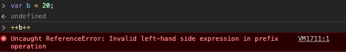
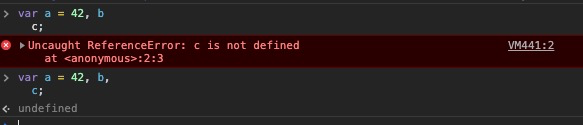

# 语法(Grammer)

## 陈述句(Statements) 和 表达式(Expression)
- Statements 类似句子，是一个由单词组成表达想法的formation, 会包含一个或多个的词组phrase，有的词组能独立成形，有的需要依赖其他单词/词组才有意义，这就是所谓的grammer

- Expression 类似词组，Operator 类似连词/标点符号

---

## 陈述句完成值(Statement Completion Values)
- `console.log`的完成值是undefined
  ```javascript
  console.log(3); // 3 undefined
  ```

- 下例中`if(...)`的完成值是5，即最后一行表达式的值，可以用`eval(...)`来验证
  ```javascript
  var a, b;
  if (true) b = 3 + 2; // 5

  a = eval('if (true) b = 3 + 2'); // 5
  a; // 5
  ```

---

## 表达式副作用(Expression Side Effect)
- `++` - 会显示返回操作对象的值
  - 下面代码示例，按照操作符运算优先级，赋值运算符的优先级远低于后置++，为什么b的值依然是12不是13呢？但d的值就是15而不是14呢？—— **因为`后置++`运算符先返回没有运算前的结果，然后才进行自增的动作, 而`(a++, a)`返回的则是后置++运算符计算完后`a`的值**
  ```javascript
  var a = 10;
  a++;
  ++a;
  var b = a++;
  b; // 12
  var c = ++a;
  c; // 14
  var d = (a++, a);
  d; // 15
  ```

  - 下面的`++e++` 会报错，因为 e++ 先执行，然后返回21，++21是错误的表达式，因为原始类型不能改变自身，且++运算符的目标只能是变量
  ```javascript
  var e = 20;
  ++e++; // ReferenceError
  ```
  

- `delete` - 会显示返回操作的结果 true/false
  ```javascript
  var obj = { a:1 } ;
  delete obj; // false
  delete obj.a; // true
  ```

- `=` - 会显示返回赋值的结果
  ```javascript
  var a, b, c;
  a = b = c = 33; //33
  ```

  ```javascript
  function test (str) {
    let match;
    // (match = str.match(/[test]/ig)) 部分的返回值充当了 && 运算符的第二个操作数
    if (str && (match = str.match(/[test]/ig)))a {
      return match; 
    }  
  }
  ```

- `-- += -=` 等运算符也是具有副作用的表达式，并且也有相应的返回值

----

## 运算符

### 运算符优先级(Operator Precedence) - Which one bind first before others
- `()` 优先级最高

- `,` 优先级比 `=` 低

- `&&` 优先级高于 `||`
  ```javascript
  false && true || true;   // true
  true || false && false;   // true
  ````

### 运算符结合律(Associativity / Grouping) - How multiple operator expressions are implicitly grouped
- 区别执行顺序(JS 依然是从左往右执行 left-to-right processing): [Example](https://codepen.io/bobby_li/pen/bPVaNR?editors=1111)

- 左结合(left-associative)
  - `&&` 和 `||` 是左结合模式 —— 虽然无论左还是右对其值都不影响
  ```javascript
  var a = true;
  var b = false;
  var c = true;

  a && b && c; // false
  (a && b) && c; // false
  a && (b && c); // false

  a || b || c; // true
  (a || b) || c; // true
  a || (b || c); // true
  ```

- 右结合(right-associative)
  - ` ? : ` 三元运算符(ternary)是右结合模式
  ```javascript
  var a = true;
  var b = 'b';
  var c = false;
  var d = 'd';
  var e = 'e';

  a ? b : c ? d : e; // 'b'
  (a ? b : c) ? d : e; // 'd'
  a ? b : (c ? d : e);  // 'b'
  ```

  - `=` 赋值运算符 右结合
  ```javascript
  var a, b, c;
  a = b = c = 42;

  // 上面的代码就相当于下面的加了()的代码
  a = (b = (c = 42));
  ```

- 当左右结合在一块时
  ```javascript
  var a = 42;
  var b = 'foo';
  var c = false; 

  var d = a && b || c ? c || b ? a : c && b : a;
  d; //42

  // 上面的代码就相当于下面的加了()的代码
  ((a && b) || c) ? ((c || b) ? a : (c && b)) : a
  ```

----

## 花括号(Curly Braces)

### 对象字面量(object literal)
- `var a = {a: 1};`

- `function foo (obj) { return obj };`

- `foo({a: 1});`

### if else / while / for / switch / function
- JS中只有`if` / `if else` 语句，并没有`if () {} else if () {}`
  ```javascript
  if (false) {
    // ...
  } else if (true) {
    // ...
  } else {
    // ...
  }

  // 上述语句相当于else 后省略了{}，因此被解析为：
  if (false) {
    // ...
  }
  else {
    if (true) {
      // ...
    }
    else {
      // ...
    }
  }
  ```

### 标签语句(label statement)
- 给块级作用域打标签
  - 区别块级作用域和对象字面量
  ```javascript
  // 对象字面量
  var a = { bar: 123 };
  // 块级作用域
  { let a = 456 };
  ```

  - 为 `for` 循环打标签
  ```javascript
  foo: for (let i = 0; i < 10; i++) {
    // ...
  };
  ```

  - 为块级作用域打标签
  ```javascript
  function foo () {
    bar: {};
  };
  ```

- 打上标签的块级作用域能被`continue`、`break`等语句识别
  - `continue` 只支持循环语句

  - `break` 可以支持循环、块级作用域等

- [这个🌰](https://codepen.io/bobby_li/pen/WqNwLO?editors=1011)说明了标签配合`continue` 和 `break`是如何工作的


### 对象解构
```javascript
function getData () { return {a: 1, b: 2}; };
var { a, b } = getData();

function ({ a, b }) {
  console.log(a, b);
};
```

### JSON
- JSON数据格式直接写在js代码中
  ```javascript
  {"a": 1}; // SyntaxError
  ```

- **JSON-P**的实现能够解决这个问题
  ```javascript
  console.log({"a": 1});
  ```

### 神奇的[]+{} 和 {}+[]
- `[] + {}`
  ```javascript
  [] + {}; // '[object Object]'

  // + 运算符进行了隐式转换，[]变成了''，{}被解释成对象，然后变成了'[object Object]'，最后进行了字符串拼接
  ```

- `{} + []`
  ```javascript
  {} + []; // 0

  // {}被JS引擎解释成 empty block，因此最终的运算是+[]，[]先被转换成字符串''，然后进行显示的数字转换，最终变成0
  ```

----

## 错误纠正(error coercion)

### ASI (Automatic Semicolon Insertion)
- JS解析代码时，在应该有分号但被省略的地方会自动插入分号

- ASI只会在分行的时候生效，而不会将分号插入行中间

- 下面代码，第一段会报错，因为c被单独分隔成一行，ASI会自动在b后面添加分号，而c不存在，因此会出现ReferenceError;
第二段不会，因为逗号将c 连接起来，是一个声明语句
  ```javascript
  var a = 42, b
  c;

  var a = 42, b,
  c;
  ```
  

- 除了少数几个特例，如 for 循环语句中的分号不能省略之外，省略的分号在JS解析都会被错误纠正(Error Correction)，但支持者和反对者各执一词：
  - ASI 从说明文档上看，是解析器的纠错机制，能让parser更具有容错力

  - 因为为了代码简洁而故意省略分号的行为，从另一个角度看是 - 我想写一段即便是不符合语法规则也依然有效的代码

  - JS 之父 Brendan Eich 有一篇“罪己诏”描述了他[对待ASI的看法](https://brendaneich.com/2012/04/the-infernal-semicolon/)

### JS Error
- 编译时(compile time)的错误一般都是*syntax error*
  - 例如`var a = /+foo/`：报错不是因为JS 句法(syntax)的错误，而是无效的正则表达式编译错误

  - 再比如`var a; 42 = a;` assignment的target必须是一个identifier

  - 严格模式下，函数的参数名不能重复
  ```javascript
  function test (a, b, a) {} 
  function test (a, b, a) { 'use strict' } // Error
  ```

- 运行时(runtime)的错误
  - 暂时性死区(TDZ Temporal Dead Zone)
  ```javascript
  {
    a = 2;
    let a; 
  };
  ```

  ```javascript
  {
    typeof a;
    typeof b;
    let b;  
  };
  ```

  ```javascript
  var b = 3;
  function foo (a = 42, b = a + b + 5) {};
  ```

- 错误处理
  - `try catch finally` 语句
    - `finally` 能够重写 `try` 和 `catch` 块里面的return

    - [举🌰](https://codepen.io/bobby_li/pen/WqpOKz?editors=1111)

  - `window.onerror` 全局错误事件

  - `element.onerror` 针对具体元素的错误事件


----

## 默认参(named parameter) 和 arguments(实参)

- 函数默认参只会针对参数是undefined生效，但是传undefined和不传，对arguments这个参数会有影响
  ```javascript
  function test (a = 42) {
    console.log(a, arguments.length);
  };

  test(); // 42 0
  test(5); // 5 1
  ```

- 如果修改参数，在严格模式下不会绑定到arguments，并且如果没有传入参数，arguments也没有可用的entries
  ```javascript
  function foo1 (a) {
    'use strict'
    a = 10;
    console.log(a, arguments[0]);
  };

  function foo2 (a) {
    a = 10;
    console.log(a, arguments[0]);
  };

  foo1(5); // 10 5
  foo2(5); // 10 10
  ```

----

## switch语句
- `switch(ele) { case val };` - `ele` 和 `val` 是用 `===` 进严格对比

- 当执行某个case，但该case没有break语句，并且后续还有case，那么后续的case都会进入，直到结束或者遇到下一个break

- [举🌰](https://codepen.io/bobby_li/pen/xoqegZ?editors=1111)