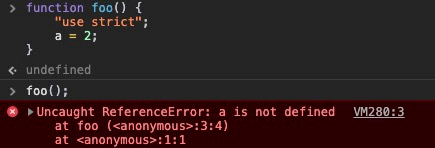
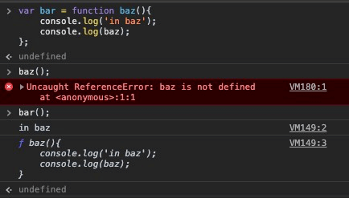

# 进入JavaScript(Into JavaScript)
这一章节的内容会对聚焦在JavaScript这门语言中一些特别东西，并且对此做一个大致的梳理过程，但是并不会深入其中。

深度探究JavaScript的起点，是从这里开始

## 值和类型(Values & Types)
JavaScript(后简称JS)，变量没有类型，只有值才有类型，下面是一些内置的类型：
- `string` - 字符串

- `number` - 数字

- `boolean` - 布尔值

- `null` 和 `undefined`

- `object` 对象类型

- `symbol`

JS 也内置了 `typeof` 运算符，能够以字符串的形式返回某个值的类型：
```javascript
var a;
typeof a; // "undefined"

a = 'test';
typeof a; // "string"

a = 2;
typeof a; // "number"

a = true;
typeof a; // "boolean"

a = null;
typeof a; // "object"

a = undefined;
typeof a; // "undefined"

a = {};
typeof a; // "object"

a = Symbol(1);
typeof a; // "symbol"
```

__Tips__: 👆注意上面的 `typeof a` 并不是询问变量 `a` 的类型，而是询问当前在变量 `a` 中的值是什么类型。

__Warning__：`typeof null` 返回的是一个 `"object"`，虽然这是一个 _bug_，但它经历了很长历史包袱，因此若是将其修复，甚至会导致更多更严重的问题。

`a = undefined` 是我们显示的给变量 `a` 赋值 `undefined`；在JS中，有以下几种能设置变量为 `undefined` 的方式：
- `var a;` —— 不设置任何值

- `a = undefined;` —— 显示的赋予`undefined`

- `var a = (function () {})()` —— 函数不返回任何值

- `void(undefined)` —— 使用 `void` 运算符

### 对象(Object)
对象是一个键值对的形式的集合，即由字符串类型的 *属性名*(properties)包含 *任意* 的复合值的集合：
```javascript
var obj = {
  a: "text",
  b: 22,
  c: false
};

obj.a; // "text"
obj.b; // 22
obj.c; // false

obj[a]; // "text"
obj[b]; // 22
obj[c]; // false
```

从对象中获取属性可以用 `.` 点运算符(dot notation) 或者 `[]` 括号运算符(bracket notation) —— 前者更常用也更方便阅读，后者在属性名含有 *特殊字符* 或者用 *变量* 时使用：
```javascript
var obj = {
  a: "text",
  b: 22,
  'test string': false
};
var b = 'a';

obj['test string']; // fasle
obj[b]; // "text"
obj['b']; // 22
```

#### 数组(Arrays)
数组是对象的一个子类型，但它的键是由数字类型的 *索引*(indexed) 组成的，并且内置了一个 `length` 的属性表示数组的长度：
```javascript
var arr = ["text", 22, false];

arr[0]; // "text"
arr[1]; // 22
arr[2]; // false
arr.length; // 3

typeof arr; // "object"
```

`length` 属性会自动根据数组的长度进行更新，但如果你自定义了非数字类型的属性名，那么新增的不会计入到 `length` 中；因此正常的使用数组的方式还是用数字类型的索引

#### 函数(Functions)
函数也是对象的一个子类型：
```javascript
function foo () {
  return 22;
}

foo.bar = 'text';

typeof foo; // "function"
typeof foo(); // "number"
typeof foo.bar; // "string"
```

虽然 `typeof foo;` 生成的结果是 `"function"`，然而函数依然可以像对象一样拥有属性，这也意味着函数是对象的一个子类型(subtype)

### 内置类型的方法(Built-In Type Methods)
内置(built-in)类型以及子(subtype)类型暴露出来的一些属性和方法十分有用：
```javascript
var a = 'text';
var b = 3.14159;

a.length; // 4
a.toUpperCase(); // "TEXT"
b.toFixed(4); // "3.1416"
```

👆`a.toUppercase()` 之所以能够这样被调用，在其底层有较为复杂的逻辑；简单讲，有一个 `String` 包装对象，通常称为内置对象(native)，与原始类型的 `string` 配对，在其原型对象`prototype`上，定义了这个叫做`toUpperCase` 的方法。当你像对象一样查询 `"text"` 的属性或者方法时，JS会自动帮我们 *包装(boxes)* 一层与之配对的对象(该例中就是 `String` 对象) —— 对于 `number` 类型的就是 `Number` 对象，`boolean` 类型的就是 `Boolean` 对象。

### 比较值(Comparing Values)
在JS中，有两种比较的类型：*相等(equality)* 和 *不相等(inequality)* 比较。无论比较的值是什么类型，比较的最终结果都是布尔值。

#### 类型转换(Coercion)
JS中有两种形式的类型转化：*显示的(explicit)* 和 *隐式的(implicit)* —— 前者是你能够明显在代码中看到的，后者是指在某些不注意的地方发生的副作用的操作产生的转换。

类型转换不是魔鬼，相反在很多地方它都很有用 —— 对于写出可读的、合理的、易于理解的代码有很大帮助：
```javascript
var a = "22";
// 显示转换 explicit
var b = Number(a);

a; // "22"
b; // 22
```

```javascript
var a = "22";
// 隐式转换 implicit
var b = a * 1;

a; // "22"
b; // 22
```

#### Turthy 和 Falsy
JS中的 `falsy` 的值：
- `""`

- `0`, `-0`, `NaN`

- `null`, `undefined`

- `false`

所有不在 `falsy` 列表中的值就是 `truthy`，比如：
- `"text"`

- `22`

- `true`

- `[ ]`、`[1, "2", 3]`

- `{ }`、`{ a: 22 }`

- `function foo () {}`

#### 相等(Equality)
记住四个相等运算操作符 `==`、`===`、`!=`、`!==`

`!` 非操作符意味着 *取反值(not equal)*

**Tips**：区别 `!= !==`(*non-equality*) 和 `>、>=、<、<=`(*inequality*)

`==` 和 `===` 的区别 *不是* 说前者只检测值是否相等，后者除了值之外还要检测类型是否相等，而是前者在比较的时候允许类型转换，后者不允许：
```javascript
var a = '22';
var b = 22;

a === b; //false
a == b; // true
```

对于👆的 `a == b`，到底是转换成了`"22" == "22"` 还是 `22 == 22` 呢？答案是后者。其转换过程比较复杂，详见[类型转换](../types%20%26%20grammar/coercion.md)一章

对于应该使用 `===` 从而避免 `==` 带来的困惑，一直以来都有很多争论，但是 `==` 确实是一个很有用的工具，你应该学习了解它的规则然后使用它，而不是全然否定掉它。这里有几个简单的规则：
- 如果值是`true` 或者 `false`，那么别使用`==`，用 `===` 代替

- 如果比较值是下面其中之一，别使用`==`，用 `===` 代替：
  - `0`

  - `""`

  - `[]`

- 其他情况下，使用 `==` 是安全可靠的，并且让你的代码更具有可读性

对于 `!=` 和 `!==` 的使用规则和相等比较基本类似，唯一的区别是取反。

需要注意的是，对于两个都是非原始类型的值的比较，`==` 和 `===` 的规则都是一样的，它们只会检查地址引用是否匹配，和它们本来的值无关：
```javascript
var a = [1,2,3];
var b = [1,2,3];
var c = '1,2,3';

a == c; // true
b == c; // true
a == b; // false
```

#### 不全等(Inequality)
`<`、`>`、`<=`、`>=` 是所谓的关系比较，比如常用的比较 *数字(number)* 的大小 —— `3 < 4`。

JS中的 *字符串(string)* 也能进行关系比较 —— 用字母顺序的规则(aka alphabetic like a dictionary)来进行比较。

如果既有 *数字(number)* 又有 *字符串(string)*，那会将字符串转换成数字后进行比较。

```javascript
var a = 22;
var b = '23';
var c = 'txt';

a < b; // true
a > b; // false
a == b; // false

a < c; // false
a > c; // false
a == c; // false
```

👆上面的 `var c = 'txt'` 在进行 *关系比较* 时会被转换成数字，但因为它不是 *类数字的字符串(numeric)*，因此会被转换成 `NaN` —— 该值不大于、小于或等于任何值，包括它自身：
```javascript
var a = NaN;

a == a; // false
```

---

## 变量(Variables)
在JS中，变量的名字有明确的规则：
- 必须以 `a`-`z`、`A`-`Z`、`$`、`_`开头

- 除去开头部分，数字`0`-`9`也能够被用于创建变量名

- _保留字(reserved word)_ 和 _关键字(keywords, `var`、`for`、`in`、`if`、`null`、`undefined`、`true`、`false`...)_ 不能被用于创建变量名

### 函数作用域(Function Scopes)
用 `var` 关键字声明的变量要么属于全局作用域，要么属于某个函数作用域。

#### 提升(Hoisting)
在任意一层的作用域中，无论 `var` 出现在哪里，这个 *声明(declaration)* 都能在这整个作用域被访问到，这个特征被称为 *提升(hoisting)*：
```javascript
var a = 2;

foo();

function foo () {
  a = 3;

  console.log(a); // 3

  var a;
}

console.log(a); // 2
```

__Warning__：我们常用的提升一般用于函数的提升，如果代码的运行依赖于变量的提升，可能让别人产生困惑。

#### 嵌套作用域(Nested Scoped)
变量在它的作用域或其作用域 *嵌套的子作用域* 都是能被访问到的：
```javascript
function foo () {
  var a = 1;

  function bar () {
    var b = 2;

    function baz () {
      var c = 3;

      console.log(a, b, c); // 1 2 3
    }

    baz();
    console.log(a, b); // 1 2
  }

  bar();
  console.log(a); // 1
}

foo();
```

如果你试图设置一个变量的值，但该变量在并没有被声明，那最终你会在全局作用域中创建这个变量，或者在 *严格模式(Strict Mode)* 中报错：
```javascript
function foo () {
  a = 5;
}

foo();
a; // 5
```

**👆这是JS的毒瘤，尽量避免写出这种💩代码！**

ES6的关键字 `let` 配合 `{}`*块(block)* 能够声明一个局部变量：
```javascript
function foo () {
  var a = 1;

  if (a >= 1) {
    let b = 2;

    while(b < 5) {
      let c = b * 2;
      b++;

      console.log(a + c);
    }
  }
}

foo(); // 5 7 9
```

用 `let` 声明的变量 `b` 和 `c` 都是局部变量，`b` 只在 `if` 语句中被访问到，而 `c` 只能在 `while` 循环中访问到。

---

## 条件(Conditionals)
在JS中要做条件判断，除了 `if` 语句，还可以用 `switch` 语句：
```javascript
if (a == 2) {
  // ...
} else if (a == 3 || a == 5) {
  // ...
} else if (a == 6) {
  // ...
} else {
  // fallback
}

switch (a) {
  case 2:
    // ...
    break;
  case 3:
  case 5:
    // ...
    break;
  case 6:
    // ...
    break;
  default:
    // fallback
}
```

注意 `switch` 语句中的 `break`，它能让你只运行匹配的 `case` 的语句，如果忽略了它，那么除了匹配的 `case`，剩下的所有 `case` 都会运行，直到遇到下一个 `break` 语句。

`?:` _条件/三元 运算符(conditional/ternary operator)_ 是另一种条件判断的形式：
```javascript
var a = 3;

var b = a > 2 ? 5 : 4;
```

---

## 严格模式(Strict Mode)
严格模式是ES5新增的，它能够让你的代码更安全，也更有准则，你可以应用在整个文件中，也可以用在单独的某个函数内：
```javascript
"use strict"

function foo () {
  // ...
}
```

```javascript
function foo () {
  "use strict"
  // ...
}
```

严格模式中最具价值的一点是不允许 *由于忽略了 `var` 而隐式的创建全局变量*：
```javascript
function foo () {
  "use strict"
  a = 2;
}

foo();
```


---

## 函数作为值(Functions As Values)
函数 `function` 就和 `22`、`'txt'`、`[1,2,3]` 一样都是值(也可以理解成表达式) —— 你不仅可以向函数传递参数，函数也能作为值赋值给某个变量：
```javascript
var foo = function () {
  // ...
};

var bar = function baz () {
  console.log('in baz');
  console.log(baz);
}
```

👆第一个表达式将一个 _匿名(anonymous)函数_ 赋值给变量 `foo`；第二个表达式将名为 `baz` 的函数赋值给变量 `bar`，此时在外层作用域只能通过 `bar` 访问到这个函数：


### 立即执行函数表达式(Immediately Invoked Function Expressions IIFEs)
一个 _immediately invoked function expression(IIFE)_ 的🌰：
```javascript
(function () {
  console.log('It is a IIFE!');
})()
```

👆上面的函数被一个括号 `()` 包裹，意味着这个函数表达式并不是普通意义上的函数声明表达式；并且在其后还有一个 `()` ，表明立即对这个函数表达式进行调用。

因为 **IIFE** 本质上是一个函数，且函数本身有一个作用域，因此 **IIFE** 常用于创建一个局部作用域的模块：
```javascript
var a = 22;

(function () {
  var a = 10;
  console.log(a); // 10
})()

console.log(a); // 22
```

**IIFE** 也能有返回值：
```javascript
var x = (function () {
  return 39;
})()

console.log(x); // 39
```

### 闭包(Closure)
